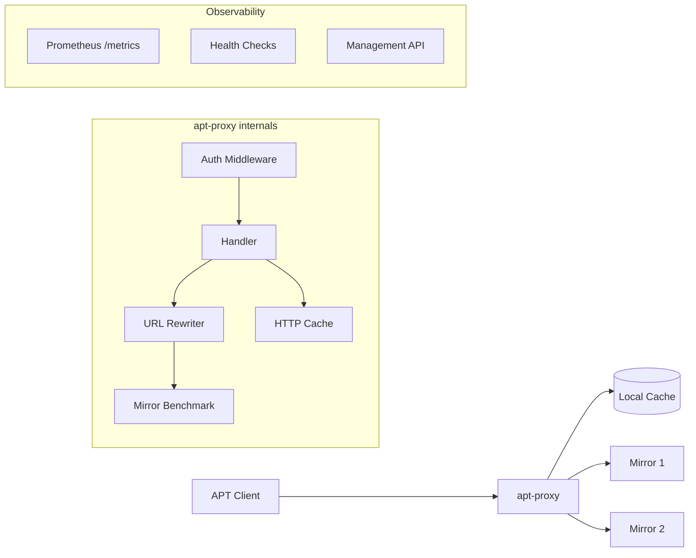

# APT Proxy

[](https://github.com/soulteary/apt-proxy/actions/workflows/scan.yml) [](https://github.com/soulteary/apt-proxy/actions/workflows/release.yaml) [](https://goreportcard.com/report/github.com/soulteary/apt-proxy) [](https://hub.docker.com/r/soulteary/apt-proxy)

<p style="text-align: center;">
  <a href="README.md">ENGLISH</a> | <a href="README_CN.md"  target="_blank">中文文档</a>
</p>


> A lightweight **APT Cache Proxy** - just over 2MB in size!


## Overview

APT Proxy is a lightweight, high-performance caching proxy for package managers. It accelerates package downloads by caching frequently used packages locally, dramatically reducing download times for subsequent installations. Whether you're managing multiple servers, building Docker images, or working in bandwidth-constrained environments, APT Proxy helps you save time and bandwidth.

### Key Features

- **Multi-Distribution Support**: Works with APT (Ubuntu/Debian), YUM (CentOS), and APK (Alpine Linux)
- **Lightweight**: Binary size is just over 2MB - minimal resource footprint
- **Smart Mirror Selection**: Automatically benchmarks and selects the fastest mirror
- **Docker-Ready**: Seamlessly integrates with Docker containers and build processes
- **Drop-in Replacement**: Compatible with [apt-cacher-ng](https://www.unix-ag.uni-kl.de/~bloch/acng/) configurations
- **Zero Configuration**: Works out of the box with sensible defaults
- **Observability**: Built-in health checks, Prometheus metrics, and structured logging
- **Cache Management**: REST API for cache statistics, purging, and cleanup

## Supported Platforms

- Linux: x86_64 / x86_32 / Ubuntu ARM64v8
- ARM: ARM64v8 / ARM32v6 / ARM32v7
- macOS: x86_64 / Apple Silicon (ARM64v8)

## Quick Start

### Installation

Download the latest release for your platform from the [releases page](https://github.com/soulteary/apt-proxy/releases), or use Docker:

```bash
docker pull soulteary/apt-proxy
```

### Running APT Proxy

Simply run the binary - no configuration required:

```bash
./apt-proxy
```

You should see output similar to:

```
2024/01/15 10:30:00 INF starting apt-proxy version=1.0.0 listen=0.0.0.0:3142 protocol=http
2024/01/15 10:30:01 INF Starting benchmark for mirrors
2024/01/15 10:30:01 INF Finished benchmarking mirrors
2024/01/15 10:30:01 INF using fastest mirror mirror=https://mirrors.company.ltd/ubuntu/
2024/01/15 10:30:01 INF server started successfully
```

The proxy is now running and ready to cache packages. By default, it listens on `0.0.0.0:3142` and automatically selects the fastest mirror for your location.

## Usage Examples

### Ubuntu / Debian

Configure your system to use the proxy by setting the `http_proxy` environment variable:

```bash
# Update package lists (first run will download and cache)
http_proxy=http://your-domain-or-ip-address:3142 \
  apt-get -o pkgProblemResolver=true -o Acquire::http=true update

# Install packages (subsequent installs will use cached packages)
http_proxy=http://your-domain-or-ip-address:3142 \
  apt-get -o pkgProblemResolver=true -o Acquire::http=true install vim -y
```

**Tip**: For convenience, you can export the proxy settings in your shell:

```bash
export http_proxy=http://your-domain-or-ip-address:3142
apt-get update
apt-get install vim -y
```

After the first download, all subsequent package operations will be significantly faster as packages are served from the local cache.

### CentOS

APT Proxy works with YUM repositories. Configure your CentOS system to use the proxy:

**For CentOS 7:**

```bash
# Configure repository to use proxy
cat /etc/yum.repos.d/CentOS-Base.repo | \
  sed -e s/mirrorlist.*$// \
      -e s/#baseurl/baseurl/ \
      -e s#http://mirror.centos.org#http://your-domain-or-ip-address:3142# | \
  tee /etc/yum.repos.d/CentOS-Base.repo

# Verify configuration
yum update
```

**For CentOS 8:**

```bash
# Update all CentOS repositories to use proxy
sed -i -e "s#mirror.centos.org#http://your-domain-or-ip-address:3142#g" \
       -e "s/#baseurl/baseurl/" \
       -e "s#\$releasever/#8-stream/#" \
       /etc/yum.repos.d/CentOS-*

# Verify configuration
yum update
```

### Alpine Linux

Configure Alpine's APK package manager to use the proxy:

```bash
# Update repositories to use proxy
cat /etc/apk/repositories | \
  sed -e s#https://.*.alpinelinux.org#http://your-domain-or-ip-address:3142# | \
  tee /etc/apk/repositories

# Verify configuration
apk update
```

## Advanced Configuration

### Custom Mirror Selection

By default, APT Proxy automatically benchmarks available mirrors and selects the fastest one. However, you can specify custom mirrors if needed.

**Using Full URLs:**

```bash
# Cache multiple distributions
./apt-proxy \
  --ubuntu=https://mirrors.tuna.tsinghua.edu.cn/ubuntu/ \
  --debian=https://mirrors.tuna.tsinghua.edu.cn/debian/

# Cache only Ubuntu packages (reduces memory usage)
./apt-proxy --mode=ubuntu --ubuntu=https://mirrors.tuna.tsinghua.edu.cn/ubuntu/

# Cache only Debian packages
./apt-proxy --mode=debian --debian=https://mirrors.tuna.tsinghua.edu.cn/debian/
```

**Using Mirror Shortcuts:**

For convenience, you can use predefined shortcuts instead of full URLs:

```bash
./apt-proxy --ubuntu=cn:tsinghua --debian=cn:163
```

**Available Shortcuts:**

- `cn:tsinghua` - Tsinghua University Mirror
- `cn:ustc` - USTC Mirror
- `cn:163` - NetEase Mirror
- `cn:aliyun` - Alibaba Cloud Mirror
- `cn:huaweicloud` - Huawei Cloud Mirror
- `cn:tencent` - Tencent Cloud Mirror

Example output:

```
2024/01/15 10:55:26 INF starting apt-proxy version=1.0.0
2024/01/15 10:55:26 INF using specified debian mirror mirror=https://mirrors.163.com/debian/
2024/01/15 10:55:26 INF using specified ubuntu mirror mirror=https://mirrors.tuna.tsinghua.edu.cn/ubuntu/
2024/01/15 10:55:26 INF proxy listening on 0.0.0.0:3142
2024/01/15 10:55:26 INF server started successfully
```

## Docker Integration

### Running APT Proxy in Docker

Deploy APT Proxy as a Docker container:

```bash
docker run -d \
  --name=apt-proxy \
  -p 3142:3142 \
  -v apt-proxy-cache:/app/.aptcache \
  soulteary/apt-proxy
```

The `-v apt-proxy-cache:/app/.aptcache` option persists the cache across container restarts.

### Using APT Proxy in Docker Builds

Accelerate package installation in your Docker containers:

```bash
# Start a container (Ubuntu or Debian)
docker run --rm -it ubuntu

# Inside the container, use the proxy
http_proxy=http://host.docker.internal:3142 \
  apt-get -o Debug::pkgProblemResolver=true -o Acquire::http=true update

http_proxy=http://host.docker.internal:3142 \
  apt-get -o Debug::pkgProblemResolver=true -o Acquire::http=true install vim -y
```

**Note**: `host.docker.internal` works on Docker Desktop. For Linux, use the host's IP address or configure Docker networking appropriately.

### Docker Compose Example

See the [example directory](example/) for complete Docker Compose configurations.

## Configuration Options

View all available options:

```bash
./apt-proxy -h
```

**Available Options:**

| Option | Description | Default |
|--------|-------------|---------|
| `-host` | Network interface to bind to | `0.0.0.0` |
| `-port` | Port to listen on | `3142` |
| `-mode` | Distribution mode: `all`, `ubuntu`, `ubuntu-ports`, `debian`, `centos`, `alpine` | `all` |
| `-cachedir` | Directory to store cached packages | `./.aptcache` |
| `-ubuntu` | Ubuntu mirror URL or shortcut | (auto-select) |
| `-ubuntu-ports` | Ubuntu Ports mirror URL or shortcut | (auto-select) |
| `-debian` | Debian mirror URL or shortcut | (auto-select) |
| `-centos` | CentOS mirror URL or shortcut | (auto-select) |
| `-alpine` | Alpine mirror URL or shortcut | (auto-select) |
| `-cache-max-size` | Maximum cache size in GB (0 to disable) | `10` |
| `-cache-ttl` | Cache TTL in hours (0 to disable) | `168` (7 days) |
| `-cache-cleanup-interval` | Cache cleanup interval in minutes | `60` |
| `-tls` | Enable TLS/HTTPS | `false` |
| `-tls-cert` | Path to TLS certificate file | |
| `-tls-key` | Path to TLS private key file | |
| `-api-key` | API key for protected endpoints | |
| `-config` | Path to YAML configuration file | |
| `-debug` | Enable verbose debug logging | `false` |

**Example with Custom Configuration:**

```bash
./apt-proxy \
  --host=0.0.0.0 \
  --port=3142 \
  --cachedir=/var/cache/apt-proxy \
  --mode=ubuntu \
  --ubuntu=cn:tsinghua \
  --cache-max-size=20 \
  --debug
```

### YAML Configuration File

APT Proxy supports YAML configuration files for more complex setups. Create a file named `apt-proxy.yaml`:

```yaml
server:
  host: 0.0.0.0
  port: 3142
  debug: false

cache:
  dir: /var/cache/apt-proxy
  max_size_gb: 20
  ttl_hours: 168
  cleanup_interval_min: 60

mirrors:
  ubuntu: cn:tsinghua
  debian: cn:ustc

tls:
  enabled: false
  cert_file: /etc/ssl/certs/apt-proxy.crt
  key_file: /etc/ssl/private/apt-proxy.key

security:
  api_key: ${APT_PROXY_API_KEY}  # Supports environment variable expansion
  enable_api_auth: true

mode: all
```

**Configuration Priority:** CLI flags > Environment variables > Config file > Default values

**Config file search paths (in order):**
1. Path specified via `-config` flag or `APT_PROXY_CONFIG_FILE` environment variable
2. `./apt-proxy.yaml` (current directory)
3. `/etc/apt-proxy/apt-proxy.yaml`
4. `~/.config/apt-proxy/apt-proxy.yaml`
5. `~/.apt-proxy.yaml`

### Cache Capacity and Eviction

The cache supports a size limit configured via `max_size_gb` (YAML), `--cache-max-size` (CLI), or `APT_PROXY_CACHE_MAX_SIZE` (environment variable). When the total cache size exceeds this limit, the proxy automatically evicts the **least recently used** (LRU) files until the total size is within the limit. Eviction runs both when storing new items and during periodic cleanup.

- Set a positive value (e.g. `20` for 20 GB) to enable the capacity limit and LRU eviction.
- Set to `0` to disable the size limit; no size-based eviction is performed.

After a process restart, the LRU order is approximated using file modification time until new accesses update it.

## API Endpoints

APT Proxy provides REST API endpoints for monitoring and management:

### Health & Monitoring

| Endpoint | Description |
|----------|-------------|
| `GET /healthz` | Comprehensive health check |
| `GET /livez` | Kubernetes liveness probe |
| `GET /readyz` | Kubernetes readiness probe |
| `GET /version` | Version information |
| `GET /metrics` | Prometheus metrics |

### Cache Management (Protected)

| Endpoint | Method | Description |
|----------|--------|-------------|
| `/api/cache/stats` | GET | Cache statistics (size, hit rate, item count) |
| `/api/cache/purge` | POST | Purge all cached items |
| `/api/cache/cleanup` | POST | Remove stale cache entries |

### Mirror Management (Protected)

| Endpoint | Method | Description |
|----------|--------|-------------|
| `/api/mirrors/refresh` | POST | Refresh mirror configurations |

### API Authentication

When an API key is configured, all management endpoints require authentication. Provide the API key using one of these methods:

1. **X-API-Key Header** (recommended):
   ```bash
   curl -H "X-API-Key: your-api-key" http://localhost:3142/api/cache/stats
   ```

2. **Authorization Bearer Token**:
   ```bash
   curl -H "Authorization: Bearer your-api-key" http://localhost:3142/api/cache/stats
   ```

**Example: Get Cache Statistics (with authentication)**

```bash
curl -H "X-API-Key: your-api-key" http://localhost:3142/api/cache/stats
```

Response:

```json
{
  "total_size_bytes": 1073741824,
  "total_size_human": "1.00 GB",
  "item_count": 150,
  "stale_count": 5,
  "hit_count": 1250,
  "miss_count": 150,
  "hit_rate": 0.893
}
```

## Hot Reload

APT Proxy supports hot reloading of mirror configurations without restart:

```bash
# Send SIGHUP to reload mirror configurations
kill -HUP $(pgrep apt-proxy)
```

Or use the API:

```bash
curl -X POST http://localhost:3142/api/mirrors/refresh
```

## Architecture



### Request Flow

1. **Client Request**: APT client sends package request to apt-proxy
2. **Cache Check**: Handler checks if package exists in local cache
3. **Cache Hit**: If cached and fresh, return immediately from cache
4. **Cache Miss**: Rewrite URL to fastest mirror, fetch from upstream
5. **Store & Respond**: Cache response and return to client

## Project Structure

```
apt-proxy/
├── apt-proxy.go              # Main entry point
├── cli/                      # CLI and daemon management
│   ├── cli.go               # Configuration parsing
│   └── daemon.go            # Server lifecycle management
├── distro/                   # Distribution definitions
│   ├── distro.go            # Common types and utilities
│   ├── ubuntu.go            # Ubuntu configuration
│   ├── debian.go            # Debian configuration
│   ├── centos.go            # CentOS configuration
│   └── alpine.go            # Alpine configuration
├── internal/                 # Internal packages
│   ├── api/                 # REST API handlers
│   │   ├── auth.go         # API authentication middleware
│   │   ├── cache.go        # Cache management endpoints
│   │   ├── mirrors.go      # Mirror management endpoints
│   │   └── response.go     # Response utilities
│   ├── config/              # Configuration management
│   │   ├── config.go       # Configuration structures
│   │   ├── defaults.go     # Default values
│   │   └── loader.go       # Configuration loading (CLI, ENV, YAML)
│   ├── errors/              # Unified error handling
│   │   └── errors.go       # Error codes and types
│   ├── proxy/               # Core proxy functionality
│   │   ├── handler.go      # HTTP request handling
│   │   ├── rewriter.go     # URL rewriting
│   │   ├── page.go         # Home page rendering
│   │   └── stats.go        # Statistics
│   ├── mirrors/             # Mirror management
│   └── benchmarks/          # Mirror benchmarking (sync & async)
├── pkg/                      # Reusable packages
│   ├── httpcache/           # HTTP caching layer with metrics
│   ├── httplog/             # Request/response logging
│   ├── stream.v1/           # Stream processing
│   ├── system/              # System utilities
│   └── vfs/                 # Virtual filesystem
├── state/                    # Application state management
├── tests/                    # Integration tests
│   └── integration/         # End-to-end tests
└── docker/, example/         # Deployment configurations
```

## Development

### Building from Source

```bash
git clone https://github.com/soulteary/apt-proxy.git
cd apt-proxy
go build -o apt-proxy .
```

### Running Tests

```bash
# Run all tests with coverage
go test -cover ./...

# Generate detailed coverage report
go test -coverprofile=coverage.out ./...
go tool cover -html=coverage.out
```

### Contributing

Contributions are welcome! Please feel free to submit a Pull Request.

## Troubleshooting

### Debug Mode

Enable debug logging to troubleshoot issues:

```bash
./apt-proxy --debug
```

### Debugging Package Operations

For detailed debugging of package manager operations (Ubuntu/Debian):

```bash
# Enable verbose debugging
http_proxy=http://192.168.33.1:3142 \
  apt-get -o Debug::pkgProblemResolver=true \
          -o Debug::Acquire::http=true \
          update

http_proxy=http://192.168.33.1:3142 \
  apt-get -o Debug::pkgProblemResolver=true \
          -o Debug::Acquire::http=true \
          install apache2
```

### Common Issues

**Issue**: Packages not being cached
**Solution**: Ensure the proxy URL is correctly configured and accessible from your client machines.

**Issue**: Slow first-time downloads
**Solution**: This is expected - the first download populates the cache. Subsequent downloads will be faster.

**Issue**: Cache directory growing too large
**Solution**: Configure cache limits with `--cache-max-size` or use the cleanup API endpoint.

## License

This project is licensed under the [Apache License 2.0](https://github.com/soulteary/apt-proxy/blob/master/LICENSE).

## Acknowledgments

This project builds upon the excellent work of:

- [lox/apt-proxy](https://github.com/lox/apt-proxy) - Original APT proxy implementation
- [lox/httpcache](https://github.com/lox/httpcache) - HTTP caching library (MIT License)
- [djherbis/stream](https://github.com/djherbis/stream) - Stream handling library (MIT License)
- [rainycape/vfs](https://github.com/rainycape/vfs) - Virtual filesystem library (Mozilla Public License 2.0)

## Support

- **Issues**: [GitHub Issues](https://github.com/soulteary/apt-proxy/issues)
- **Discussions**: [GitHub Discussions](https://github.com/soulteary/apt-proxy/discussions)

---

Made with ❤️ by the APT Proxy community
