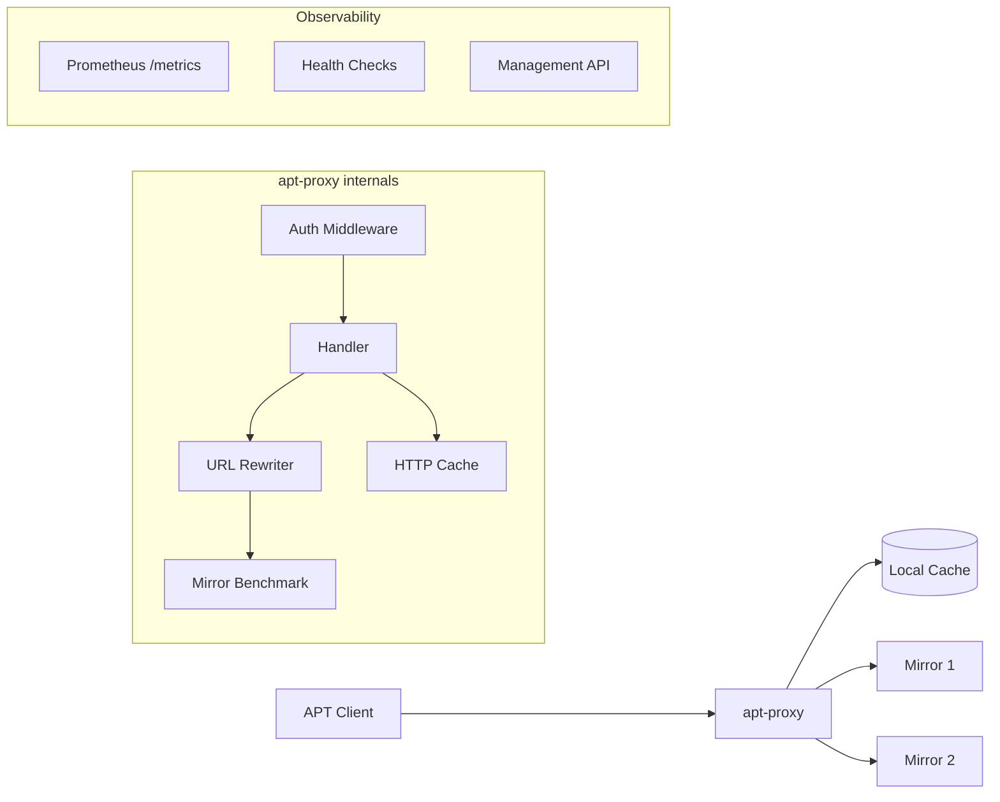

# APT Proxy

[](https://github.com/soulteary/apt-proxy/actions/workflows/scan.yml) [](https://github.com/soulteary/apt-proxy/actions/workflows/release.yaml) [](https://goreportcard.com/report/github.com/soulteary/apt-proxy) [](https://hub.docker.com/r/soulteary/apt-proxy)

<p style="text-align: center;">
  <a href="README.md">ENGLISH</a> | <a href="README_CN.md"  target="_blank">中文文档</a>
</p>


> A lightweight **APT Cache Proxy** - just over 2MB in size!


## Overview

APT Proxy is a lightweight, high-performance caching proxy for package managers. It accelerates package downloads by caching frequently used packages locally, dramatically reducing download times for subsequent installations. Whether you're managing multiple servers, building Docker images, or working in bandwidth-constrained environments, APT Proxy helps you save time and bandwidth.

### Key Features

- **Multi-Distribution Support**: Works with APT (Ubuntu/Debian), YUM (CentOS), and APK (Alpine Linux)
- **Lightweight**: Binary size is just over 2MB - minimal resource footprint
- **Smart Mirror Selection**: Automatically benchmarks and selects the fastest mirror
- **Docker-Ready**: Seamlessly integrates with Docker containers and build processes
- **Drop-in Replacement**: Compatible with [apt-cacher-ng](https://www.unix-ag.uni-kl.de/~bloch/acng/) configurations
- **Zero Configuration**: Works out of the box with sensible defaults
- **Observability**: Built-in health checks, Prometheus metrics, structured logging, and optional OpenTelemetry tracing
- **Cache Management**: REST API for cache statistics, purging, and cleanup, with API-key authentication and per-IP rate limiting

## Supported Platforms

- Linux: x86_64 / x86_32 / Ubuntu ARM64v8
- ARM: ARM64v8 / ARM32v6 / ARM32v7
- macOS: x86_64 / Apple Silicon (ARM64v8)

## Quick Start

### Installation

Download the latest release for your platform from the [releases page](https://github.com/soulteary/apt-proxy/releases), or use Docker:

```bash
docker pull soulteary/apt-proxy
```

### Running APT Proxy

Simply run the binary - no configuration required:

```bash
./apt-proxy
```

You should see output similar to:

```
2024/01/15 10:30:00 INF starting apt-proxy version=1.0.0 listen=0.0.0.0:3142 protocol=http
2024/01/15 10:30:01 INF Starting benchmark for mirrors
2024/01/15 10:30:01 INF Finished benchmarking mirrors
2024/01/15 10:30:01 INF using fastest mirror mirror=https://mirrors.company.ltd/ubuntu/
2024/01/15 10:30:01 INF server started successfully
```

The proxy is now running and ready to cache packages. By default, it listens on `0.0.0.0:3142` and automatically selects the fastest mirror for your location.

## Usage Examples

### Ubuntu / Debian

Configure your system to use the proxy by setting the `http_proxy` environment variable:

```bash
# Update package lists (first run will download and cache)
http_proxy=http://your-domain-or-ip-address:3142 \
  apt-get -o pkgProblemResolver=true -o Acquire::http=true update

# Install packages (subsequent installs will use cached packages)
http_proxy=http://your-domain-or-ip-address:3142 \
  apt-get -o pkgProblemResolver=true -o Acquire::http=true install vim -y
```

**Tip**: For convenience, you can export the proxy settings in your shell:

```bash
export http_proxy=http://your-domain-or-ip-address:3142
apt-get update
apt-get install vim -y
```

After the first download, all subsequent package operations will be significantly faster as packages are served from the local cache.

### CentOS

APT Proxy works with YUM repositories. Configure your CentOS system to use the proxy:

**For CentOS 7:**

```bash
# Configure repository to use proxy
cat /etc/yum.repos.d/CentOS-Base.repo | \
  sed -e s/mirrorlist.*$// \
      -e s/#baseurl/baseurl/ \
      -e s#http://mirror.centos.org#http://your-domain-or-ip-address:3142# | \
  tee /etc/yum.repos.d/CentOS-Base.repo

# Verify configuration
yum update
```

**For CentOS 8:**

```bash
# Update all CentOS repositories to use proxy
sed -i -e "s#mirror.centos.org#http://your-domain-or-ip-address:3142#g" \
       -e "s/#baseurl/baseurl/" \
       -e "s#\$releasever/#8-stream/#" \
       /etc/yum.repos.d/CentOS-*

# Verify configuration
yum update
```

### Alpine Linux

Configure Alpine's APK package manager to use the proxy:

```bash
# Update repositories to use proxy
cat /etc/apk/repositories | \
  sed -e s#https://.*.alpinelinux.org#http://your-domain-or-ip-address:3142# | \
  tee /etc/apk/repositories

# Verify configuration
apk update
```

## Advanced Configuration

### Distributions and Mirrors Config (distributions.yaml)

You can maintain distributions and mirror lists via an external YAML file without changing code or recompiling.

**Config file search order (when not specified):**

1. `./config/distributions.yaml`
2. `./distributions.yaml`
3. `/etc/apt-proxy/distributions.yaml`
4. `~/.config/apt-proxy/distributions.yaml`

You can also set the path explicitly via `--distributions-config` or `APT_PROXY_DISTRIBUTIONS_CONFIG`.

**Example `config/distributions.yaml`:**

```yaml
distributions:
  - id: ubuntu
    name: Ubuntu
    type: 1
    url_pattern: "/ubuntu/(.+)$"
    benchmark_url: "dists/noble/main/binary-amd64/Release"
    geo_mirror_api: "http://mirrors.ubuntu.com/mirrors.txt"
    cache_rules:
      - pattern: "deb$"
        cache_control: "max-age=100000"
        rewrite: true
    mirrors:
      official:
        - "mirrors.tuna.tsinghua.edu.cn/ubuntu/"
        - "mirrors.ustc.edu.cn/ubuntu/"
      custom:
        - "mirrors.163.com/ubuntu/"
    aliases:
      tsinghua: "mirrors.tuna.tsinghua.edu.cn/ubuntu/"
      ustc: "mirrors.ustc.edu.cn/ubuntu/"
```

After editing the file, send **SIGHUP** or call **POST /api/mirrors/refresh** to hot-reload without restart.

**Field reference:**

- `id` — unique identifier used in URL paths (`/<id>/...`).
- `name` — human-readable display name.
- `type` — integer distro type: `1` Ubuntu, `2` UbuntuPorts, `3` Debian, `4` CentOS, `5` Alpine. `0` is reserved for "all".
- `url_pattern` — regex matched against the request path; the captured group is appended to the upstream mirror.
- `benchmark_url` — relative path probed during mirror benchmarking.
- `geo_mirror_api` — optional URL returning a list of geo-located mirrors (Ubuntu-style `mirrors.txt`).
- `cache_rules[]` — per-pattern cache directives. `cache_control` overrides response `Cache-Control` for matched paths (only applied to `200`/`404` responses); `rewrite: true` enables URL rewriting for that pattern.
- `mirrors.official` / `mirrors.custom` — mirror host lists. Aliases of the form `cn:<name>` are auto-generated from each mirror's host (e.g. `mirrors.tuna.tsinghua.edu.cn` → `cn:tsinghua`).
- `aliases` — explicit name-to-mirror mapping that overrides/augments the auto-generated aliases.

**Adding or editing a distribution:** Add or edit an entry under `distributions` with `id`, `name`, `type`, `url_pattern`, `benchmark_url`, `cache_rules`, `mirrors`, and `aliases`. The repo includes an example at `config/distributions.yaml` that you can extend.

### Custom Mirror Selection

By default, APT Proxy automatically benchmarks available mirrors and selects the fastest one. However, you can specify custom mirrors if needed.

**Using Full URLs:**

```bash
# Cache multiple distributions
./apt-proxy \
  --ubuntu=https://mirrors.tuna.tsinghua.edu.cn/ubuntu/ \
  --debian=https://mirrors.tuna.tsinghua.edu.cn/debian/

# Cache only Ubuntu packages (reduces memory usage)
./apt-proxy --mode=ubuntu --ubuntu=https://mirrors.tuna.tsinghua.edu.cn/ubuntu/

# Cache only Debian packages
./apt-proxy --mode=debian --debian=https://mirrors.tuna.tsinghua.edu.cn/debian/
```

**Using Mirror Shortcuts:**

For convenience, you can use predefined shortcuts instead of full URLs:

```bash
./apt-proxy --ubuntu=cn:tsinghua --debian=cn:163
```

**Available Shortcuts:**

- `cn:tsinghua` - Tsinghua University Mirror
- `cn:ustc` - USTC Mirror
- `cn:163` - NetEase Mirror
- `cn:aliyun` - Alibaba Cloud Mirror
- `cn:huaweicloud` - Huawei Cloud Mirror
- `cn:tencent` - Tencent Cloud Mirror

Example output:

```
2024/01/15 10:55:26 INF starting apt-proxy version=1.0.0
2024/01/15 10:55:26 INF using specified debian mirror mirror=https://mirrors.163.com/debian/
2024/01/15 10:55:26 INF using specified ubuntu mirror mirror=https://mirrors.tuna.tsinghua.edu.cn/ubuntu/
2024/01/15 10:55:26 INF proxy listening on 0.0.0.0:3142
2024/01/15 10:55:26 INF server started successfully
```

## Docker Integration

### Running APT Proxy in Docker

Deploy APT Proxy as a Docker container:

```bash
docker run -d \
  --name=apt-proxy \
  -p 3142:3142 \
  -v apt-proxy-cache:/app/.aptcache \
  soulteary/apt-proxy
```

The `-v apt-proxy-cache:/app/.aptcache` option persists the cache across container restarts.

### Using APT Proxy in Docker Builds

Accelerate package installation in your Docker containers:

```bash
# Start a container (Ubuntu or Debian)
docker run --rm -it ubuntu

# Inside the container, use the proxy
http_proxy=http://host.docker.internal:3142 \
  apt-get -o Debug::pkgProblemResolver=true -o Acquire::http=true update

http_proxy=http://host.docker.internal:3142 \
  apt-get -o Debug::pkgProblemResolver=true -o Acquire::http=true install vim -y
```

**Note**: `host.docker.internal` works on Docker Desktop. For Linux, use the host's IP address or configure Docker networking appropriately.

### Docker Compose Example

See the [example directory](example/) for complete Docker Compose configurations.

## Configuration Options

View all available options:

```bash
./apt-proxy -h
```

**Available Options:**

| Option | Description | Default |
|--------|-------------|---------|
| `-host` | Network interface to bind to | `0.0.0.0` |
| `-port` | Port to listen on | `3142` |
| `-mode` | Distribution mode: `all`, `ubuntu`, `ubuntu-ports`, `debian`, `centos`, `alpine` | `all` |
| `-cachedir` | Directory to store cached packages | `./.aptcache` |
| `-ubuntu` | Ubuntu mirror URL or shortcut | (auto-select) |
| `-ubuntu-ports` | Ubuntu Ports mirror URL or shortcut | (auto-select) |
| `-debian` | Debian mirror URL or shortcut | (auto-select) |
| `-centos` | CentOS mirror URL or shortcut | (auto-select) |
| `-alpine` | Alpine mirror URL or shortcut | (auto-select) |
| `-distributions-config` | Path to distributions/mirrors YAML (distributions.yaml) | (optional) |
| `-cache-max-size` | Maximum cache size in GB (0 to disable) | `10` |
| `-cache-ttl` | Cache TTL in hours (0 to disable) | `168` (7 days) |
| `-cache-cleanup-interval` | Cache cleanup interval in minutes | `60` |
| `-tls` | Enable TLS/HTTPS (requires `-tls-cert` and `-tls-key`) | `false` |
| `-tls-cert` | Path to TLS certificate file | |
| `-tls-key` | Path to TLS private key file | |
| `-api-key` | API key for protected endpoints (auto-enables auth when set) | |
| `-enable-api-auth` | Explicitly enable/disable API authentication middleware | `false` (auto `true` when `-api-key` is set) |
| `-api-rate-limit` | API requests per IP per minute (`0` to disable) | `60` |
| `-trusted-proxies` | Comma-separated CIDRs whose `X-Forwarded-For` is honored by rate limiter and auth | |
| `-upstream-keep-alive` | Enable HTTP keep-alive to upstream mirrors (CLI/ENV only; not configurable via YAML) | `true` |
| `-config` | Path to YAML configuration file | |
| `-debug` | Enable verbose debug logging (also dumps request headers/body to logs) | `false` |

**Example with Custom Configuration:**

```bash
./apt-proxy \
  --host=0.0.0.0 \
  --port=3142 \
  --cachedir=/var/cache/apt-proxy \
  --mode=ubuntu \
  --ubuntu=cn:tsinghua \
  --cache-max-size=20 \
  --debug
```

### Environment Variables

Every CLI flag has an equivalent environment variable. Plus a few extras for logging and tracing.

**Server / Mode**

| Variable | Equivalent flag | Description |
|----------|-----------------|-------------|
| `APT_PROXY_HOST` | `-host` | Network interface to bind to |
| `APT_PROXY_PORT` | `-port` | Port to listen on |
| `APT_PROXY_MODE` | `-mode` | Distribution mode (`all`/`ubuntu`/`ubuntu-ports`/`debian`/`centos`/`alpine`) |
| `APT_PROXY_DEBUG` | `-debug` | Enable verbose debug logging |
| `APT_PROXY_UBUNTU` | `-ubuntu` | Ubuntu mirror URL or shortcut |
| `APT_PROXY_UBUNTU_PORTS` | `-ubuntu-ports` | Ubuntu Ports mirror URL or shortcut |
| `APT_PROXY_DEBIAN` | `-debian` | Debian mirror URL or shortcut |
| `APT_PROXY_CENTOS` | `-centos` | CentOS mirror URL or shortcut |
| `APT_PROXY_ALPINE` | `-alpine` | Alpine mirror URL or shortcut |
| `APT_PROXY_UPSTREAM_KEEP_ALIVE` | `-upstream-keep-alive` | HTTP keep-alive to upstream mirrors |

**Cache**

| Variable | Equivalent flag | Description |
|----------|-----------------|-------------|
| `APT_PROXY_CACHEDIR` | `-cachedir` | Cache directory |
| `APT_PROXY_CACHE_MAX_SIZE` | `-cache-max-size` | Maximum cache size in GB (`0` disables) |
| `APT_PROXY_CACHE_TTL` | `-cache-ttl` | Cache TTL in hours (`0` disables) |
| `APT_PROXY_CACHE_CLEANUP_INTERVAL` | `-cache-cleanup-interval` | Cache cleanup interval in minutes (`0` disables) |

**TLS**

| Variable | Equivalent flag | Description |
|----------|-----------------|-------------|
| `APT_PROXY_TLS_ENABLED` | `-tls` | Enable TLS/HTTPS |
| `APT_PROXY_TLS_CERT` | `-tls-cert` | Path to TLS certificate |
| `APT_PROXY_TLS_KEY` | `-tls-key` | Path to TLS private key |

**Security (API)**

| Variable | Equivalent flag | Description |
|----------|-----------------|-------------|
| `APT_PROXY_API_KEY` | `-api-key` | API key for protected endpoints |
| `APT_PROXY_ENABLE_API_AUTH` | `-enable-api-auth` | Explicit toggle for API auth middleware |
| `APT_PROXY_API_RATE_LIMIT_PER_MINUTE` | `-api-rate-limit` | API requests per IP per minute (`0` disables) |
| `APT_PROXY_TRUSTED_PROXIES` | `-trusted-proxies` | Comma-separated trusted proxy CIDRs |

**Configuration files**

| Variable | Equivalent flag | Description |
|----------|-----------------|-------------|
| `APT_PROXY_CONFIG_FILE` | `-config` | Path to `apt-proxy.yaml` |
| `APT_PROXY_DISTRIBUTIONS_CONFIG` | `-distributions-config` | Path to `distributions.yaml` |

**Logging & Tracing** (no CLI equivalent)

| Variable | Description |
|----------|-------------|
| `APT_PROXY_LOG_LEVEL` | Log level: `debug` / `info` / `warn` / `error`. `--debug` forces `debug`. |
| `APT_PROXY_LOG_FORMAT` | Log format: `json` / `console` / `auto` (auto-detects based on TTY). |
| `LOG_LEVEL` | Legacy alias; only used when `APT_PROXY_LOG_LEVEL` is unset. |
| `LOG_FORMAT` | Legacy alias; only used when `APT_PROXY_LOG_FORMAT` is unset. |
| `OTEL_EXPORTER_OTLP_ENDPOINT` | When set, enables OpenTelemetry tracing and exports spans via OTLP to this endpoint. Spans are flushed on graceful shutdown. |

**Configuration Priority:** CLI flags > Environment variables > Config file > Default values

### YAML Configuration File

APT Proxy supports YAML configuration files for more complex setups. Create a file named `apt-proxy.yaml`:

```yaml
server:
  host: 0.0.0.0
  port: 3142
  debug: false

cache:
  dir: /var/cache/apt-proxy
  max_size_gb: 20
  ttl_hours: 168
  cleanup_interval_min: 60

mirrors:
  ubuntu: cn:tsinghua
  ubuntu_ports: ""
  debian: cn:ustc
  centos: ""
  alpine: ""

tls:
  enabled: false
  cert_file: /etc/ssl/certs/apt-proxy.crt
  key_file: /etc/ssl/private/apt-proxy.key

security:
  api_key: ${APT_PROXY_API_KEY}        # supports ${VAR} and ${VAR:-default} expansion
  enable_api_auth: true
  api_rate_limit_per_minute: 60        # 0 disables; default 60
  trusted_proxies:                     # CIDRs whose X-Forwarded-For is trusted
    - 10.0.0.0/8
    - 192.168.0.0/16

mode: all

# Optional: external distributions/mirrors config (hot-reloadable)
distributions_config: ./config/distributions.yaml
```

**Environment variable expansion in YAML:** values support `${VAR}` and `${VAR:-default}` forms. Bare `$VAR` is **not** expanded. An undefined `${VAR}` is left as-is (instead of becoming empty) so that typos surface loudly.

**Note:** `upstream_keep_alive` is **not** read from YAML — configure it via `--upstream-keep-alive` or `APT_PROXY_UPSTREAM_KEEP_ALIVE`. Likewise, only the human-friendly cache fields shown above (`dir`, `max_size_gb`, `ttl_hours`, `cleanup_interval_min`) are valid; raw byte/duration fields are internal representations.

**Config file search paths (in order):**
1. Path specified via `-config` flag or `APT_PROXY_CONFIG_FILE` environment variable
2. `./apt-proxy.yaml` (current directory)
3. `/etc/apt-proxy/apt-proxy.yaml`
4. `~/.config/apt-proxy/apt-proxy.yaml`
5. `~/.apt-proxy.yaml`

### Cache Capacity and Eviction

The cache supports a size limit configured via `max_size_gb` (YAML), `--cache-max-size` (CLI), or `APT_PROXY_CACHE_MAX_SIZE` (environment variable). When the total cache size exceeds this limit, the proxy automatically evicts the **least recently used** (LRU) files until the total size is within the limit. Eviction runs both when storing new items and during periodic cleanup.

- Set a positive value (e.g. `20` for 20 GB) to enable the capacity limit and LRU eviction.
- Set to `0` to disable the size limit; no size-based eviction is performed.

After a process restart, the LRU order is approximated using file modification time until new accesses update it.

## API Endpoints

APT Proxy provides REST API endpoints for monitoring and management:

### Health & Monitoring

| Endpoint | Description |
|----------|-------------|
| `GET /healthz` | Aggregated health check (cache, dependencies) |
| `GET /livez` | Kubernetes liveness probe (lightweight, no dependencies) |
| `GET /readyz` | Kubernetes readiness probe (currently shares the same aggregator as `/healthz`) |
| `GET /version` | Version information (also available via `X-Version` response header on every response) |
| `GET /metrics` | Prometheus metrics |
| `ALL /_/ping`, `ALL /_/ping/*` | Cheap reachability probe; always returns `pong` |
| `GET /` | Internal status page (HTML) showing routes, mirrors, and cache stats |

### Cache Management (Protected)

| Endpoint | Method | Description |
|----------|--------|-------------|
| `/api/cache/stats` | GET | Cache statistics (size, hit rate, item count) |
| `/api/cache/purge` | POST | Purge all cached items |
| `/api/cache/cleanup` | POST | Remove stale cache entries |

### Mirror Management (Protected)

| Endpoint | Method | Description |
|----------|--------|-------------|
| `/api/mirrors/refresh` | POST | Reload distributions/mirrors config (distributions.yaml) and refresh mirrors |

### API Authentication

When an API key is configured, all `/api/*` endpoints require authentication. Setting `--api-key` (or `APT_PROXY_API_KEY`) implicitly enables auth; pass `--enable-api-auth=false` to force-disable it. Provide the API key using one of these methods:

1. **X-API-Key Header** (recommended):
   ```bash
   curl -H "X-API-Key: your-api-key" http://localhost:3142/api/cache/stats
   ```

2. **Authorization Bearer Token**:
   ```bash
   curl -H "Authorization: Bearer your-api-key" http://localhost:3142/api/cache/stats
   ```

### API Rate Limiting

All `/api/*` endpoints are subject to per-IP rate limiting. The default budget is **60 requests per IP per minute** (sliding 1-minute window); set `--api-rate-limit=0` to disable. When the limit is exceeded the server responds with HTTP `429 Too Many Requests` and a JSON body whose error code is `ErrRateLimited`.

By default the client IP is taken from `RemoteAddr`. To honor `X-Forwarded-For` (e.g. behind nginx, ALB, or a cloud LB), pass the **trusted proxy CIDRs** via `--trusted-proxies=10.0.0.0/8,192.168.0.0/16` (or `APT_PROXY_TRUSTED_PROXIES`). Only requests originating from those CIDRs will have their `X-Forwarded-For` parsed; otherwise it is ignored to prevent spoofing.

### Response Headers

The server attaches the following headers to every response:

- `X-Version`, `X-Build-*` — version and build metadata (also available at `GET /version`).
- Standard security headers (e.g. `X-Content-Type-Options`, `X-Frame-Options`, `Referrer-Policy`, `Strict-Transport-Security` when TLS is on).
- `X-Cache: HIT` / `MISS` / `SKIP` on proxy responses (used by the request logger to classify traffic).

**Example: Get Cache Statistics (with authentication)**

```bash
curl -H "X-API-Key: your-api-key" http://localhost:3142/api/cache/stats
```

Response:

```json
{
  "total_size_bytes": 1073741824,
  "total_size_human": "1.00 GB",
  "item_count": 150,
  "stale_count": 5,
  "hit_count": 1250,
  "miss_count": 150,
  "hit_rate": 0.893
}
```

## Hot Reload

APT Proxy supports hot reloading of **distributions and mirror config only** (including `distributions.yaml`) without restart. Changes to the **main configuration** (e.g. `apt-proxy.yaml`: server host/port, cache limits, TLS, security, API key) **do not** hot-reload and require a process restart.

To reload distributions and mirrors:

```bash
# Send SIGHUP to reload config and refresh mirrors
kill -HUP $(pgrep apt-proxy)
```

Or use the API:

```bash
curl -X POST http://localhost:3142/api/mirrors/refresh
```

Both paths are equivalent: they reload `distributions.yaml` and re-run mirror selection. SIGHUP signals are debounced (consecutive signals within ~500ms are coalesced) and queued (at most one extra reload is scheduled while a reload is in progress), so it is safe to invoke them rapidly from scripts.

## Observability

### Metrics

The `/metrics` endpoint exposes Prometheus metrics. Key metrics and suggested alerts:

| Metric / area | Description | Suggested alert |
|---------------|-------------|-----------------|
| `apt_proxy_cache_hits_total` / `apt_proxy_cache_misses_total` | Cache hits and misses | Hit ratio drops sharply |
| `apt_proxy_cache_size_bytes` / `apt_proxy_cache_items` | Current cache footprint | Cache size near `--cache-max-size` limit |
| `apt_proxy_cache_evictions_total` | LRU evictions due to size limit | Sustained eviction rate (cache too small) |
| `apt_proxy_cache_cleanup_duration_seconds` | Periodic cleanup duration | Cleanup taking too long |
| `apt_proxy_cache_upstream_request_duration_seconds{method,status}` | Upstream request latency by method/status | P99 above threshold |
| `apt_proxy_cache_upstream_errors_total` | Upstream fetch errors | Error rate spike |
| Health (`/healthz`, `/readyz`) | Service and dependency health | Probes failing |

Exact labels and additional series are emitted by the underlying [httpcache-kit](https://github.com/soulteary/httpcache-kit); scrape `/metrics` to enumerate them.

### Logging

Logging is structured (JSON or console) and configured purely via environment variables:

- `APT_PROXY_LOG_LEVEL` — `debug` / `info` / `warn` / `error` (default `info`). `LOG_LEVEL` is honored as a legacy fallback.
- `APT_PROXY_LOG_FORMAT` — `json` / `console` / `auto` (default `auto`, picks `console` when stdout is a TTY). `LOG_FORMAT` is honored as a legacy fallback.
- `--debug` / `APT_PROXY_DEBUG=true` forces `debug` level **and** dumps request headers and bodies into access logs — use only for troubleshooting.

Each request log carries `request_id`, `cache` (`HIT`/`MISS`/`SKIP`/empty), and the response `size`. The probe paths `/healthz`, `/livez`, and `/readyz` are excluded from access logs to keep them quiet.

### Distributed Tracing (OpenTelemetry)

Set `OTEL_EXPORTER_OTLP_ENDPOINT` to your OTLP collector (e.g. `http://otel-collector:4317`) to enable OpenTelemetry tracing. The exporter is wired up automatically; spans are flushed during graceful shutdown. Tracing is disabled when the variable is unset.

## Architecture


```mermaid
flowchart LR
    Client[APT Client] --> Proxy[apt-proxy]
    Proxy --> Cache[(Local Cache)]
    Proxy --> Mirror1[Mirror 1]
    Proxy --> Mirror2[Mirror 2]
    
    subgraph aptproxy [apt-proxy internals]
        Handler[Handler] --> Rewriter[URL Rewriter]
        Rewriter --> Benchmark[Mirror Benchmark]
        Handler --> HTTPCache[HTTP Cache]
        Auth[Auth Middleware] --> Handler
    end
    
    subgraph monitoring [Observability]
        Metrics[Prometheus /metrics]
        Health[Health Checks]
        API[Management API]
    end
```

### Request Flow

1. **Client Request**: APT client sends package request to apt-proxy
2. **Cache Check**: Handler checks if package exists in local cache
3. **Cache Hit**: If cached and fresh, return immediately from cache
4. **Cache Miss**: Rewrite URL to fastest mirror, fetch from upstream
5. **Store & Respond**: Cache response and return to client

## Project Structure

```
apt-proxy/
├── cmd/
│   └── apt-proxy/            # Application entrypoint
│       └── main.go           # Main entry point
├── internal/                 # Private application code
│   ├── api/                  # REST API handlers and middlewares
│   │   ├── auth.go           # API authentication middleware
│   │   ├── cache.go          # Cache management endpoints
│   │   ├── mirrors.go        # Mirror management endpoints
│   │   ├── ratelimit.go      # Per-IP rate limiting middleware
│   │   ├── clientip.go       # Client IP extraction (X-Forwarded-For + trusted proxies)
│   │   └── response.go       # Response utilities
│   ├── benchmarks/           # Mirror benchmarking (sync & async)
│   ├── cli/                  # CLI and daemon management
│   │   ├── cli.go            # Entrypoint, version wiring
│   │   ├── daemon.go         # Server lifecycle, routing, signal handling
│   │   └── health.go         # Custom Fiber health handler (race-safe shutdown)
│   ├── config/               # Configuration management
│   │   ├── config.go         # Configuration structures
│   │   ├── defaults.go       # Default values and env var keys
│   │   ├── loader.go         # Config loading orchestration
│   │   ├── loader_flags.go   # CLI flag parsing
│   │   ├── loader_yaml.go    # YAML loading + ${VAR}/${VAR:-default} expansion
│   │   ├── loader_merge.go   # CLI/ENV/file/defaults merging with explicit-flag tracking
│   │   ├── loader_search.go  # Config file search paths
│   │   └── loader_validate.go# Validation (paths, TLS files, cache writability)
│   ├── distro/               # Distribution definitions and registry
│   │   ├── distro.go         # Common types and utilities
│   │   ├── registry.go       # Built-in distro registry
│   │   ├── loader.go         # distributions.yaml loader and search paths
│   │   ├── rules.go          # Cache rule helpers
│   │   ├── ubuntu.go         # Ubuntu configuration
│   │   ├── ubuntu-ports.go   # Ubuntu Ports configuration
│   │   ├── debian.go         # Debian configuration
│   │   ├── centos.go         # CentOS configuration
│   │   └── alpine.go         # Alpine configuration
│   ├── errors/               # Unified error handling
│   │   └── errors.go         # Error codes and types
│   ├── mirrors/              # Mirror management
│   │   ├── mirrors.go        # Mirror list resolution
│   │   ├── ubuntu.go         # Ubuntu geo-mirror discovery
│   │   └── templates.go      # URL templating helpers
│   ├── proxy/                # Core proxy functionality
│   │   ├── handler.go        # HTTP request handling
│   │   ├── rewriter.go       # URL rewriting
│   │   ├── transport.go      # Upstream HTTP transport (keep-alive, timeouts)
│   │   ├── page.go           # Home page rendering
│   │   └── stats.go          # Statistics
│   ├── state/                # Application state management
│   └── system/               # System utilities (disk, gc, filesize)
├── tests/                    # Integration tests
│   └── integration/          # End-to-end tests
└── config/, docker/, example/ # Sample configs, deployment, and docs
```

## Development

### Building from Source

```bash
git clone https://github.com/soulteary/apt-proxy.git
cd apt-proxy
go build -o apt-proxy ./cmd/apt-proxy
```

When developing alongside [vfs-kit](https://github.com/soulteary/vfs-kit) or [httpcache-kit](https://github.com/soulteary/httpcache-kit), `go.mod` may use `replace` directives (e.g. `../kits/httpcache-kit`); remove them when using published versions.

### Running Tests

```bash
# Run all tests with coverage
go test -cover ./...

# Generate detailed coverage report
go test -coverprofile=coverage.out ./...
go tool cover -html=coverage.out
```

### Contributing

Contributions are welcome! Please feel free to submit a Pull Request.

## Troubleshooting

### Debug Mode

Enable debug logging to troubleshoot issues:

```bash
./apt-proxy --debug
```

### Debugging Package Operations

For detailed debugging of package manager operations (Ubuntu/Debian):

```bash
# Enable verbose debugging
http_proxy=http://192.168.33.1:3142 \
  apt-get -o Debug::pkgProblemResolver=true \
          -o Debug::Acquire::http=true \
          update

http_proxy=http://192.168.33.1:3142 \
  apt-get -o Debug::pkgProblemResolver=true \
          -o Debug::Acquire::http=true \
          install apache2
```

### Common Issues

**Issue**: Packages not being cached
**Solution**: Ensure the proxy URL is correctly configured and accessible from your client machines.

**Issue**: Slow first-time downloads
**Solution**: This is expected - the first download populates the cache. Subsequent downloads will be faster.

**Issue**: Cache directory growing too large
**Solution**: Configure cache limits with `--cache-max-size` or use the cleanup API endpoint.

## License

This project is licensed under the [Apache License 2.0](https://github.com/soulteary/apt-proxy/blob/master/LICENSE).

## Acknowledgments

This project builds upon the excellent work of:

- [lox/apt-proxy](https://github.com/lox/apt-proxy) - Original APT proxy implementation
- [lox/httpcache](https://github.com/lox/httpcache) - HTTP caching library (MIT License)
- [djherbis/stream](https://github.com/djherbis/stream) - Stream handling library (MIT License)
- [soulteary/vfs-kit](https://github.com/soulteary/vfs-kit) - Virtual filesystem library (from rainycape/vfs, Mozilla Public License 2.0)

## Support

- **Issues**: [GitHub Issues](https://github.com/soulteary/apt-proxy/issues)
- **Discussions**: [GitHub Discussions](https://github.com/soulteary/apt-proxy/discussions)

---

Made with ❤️ by the APT Proxy community
