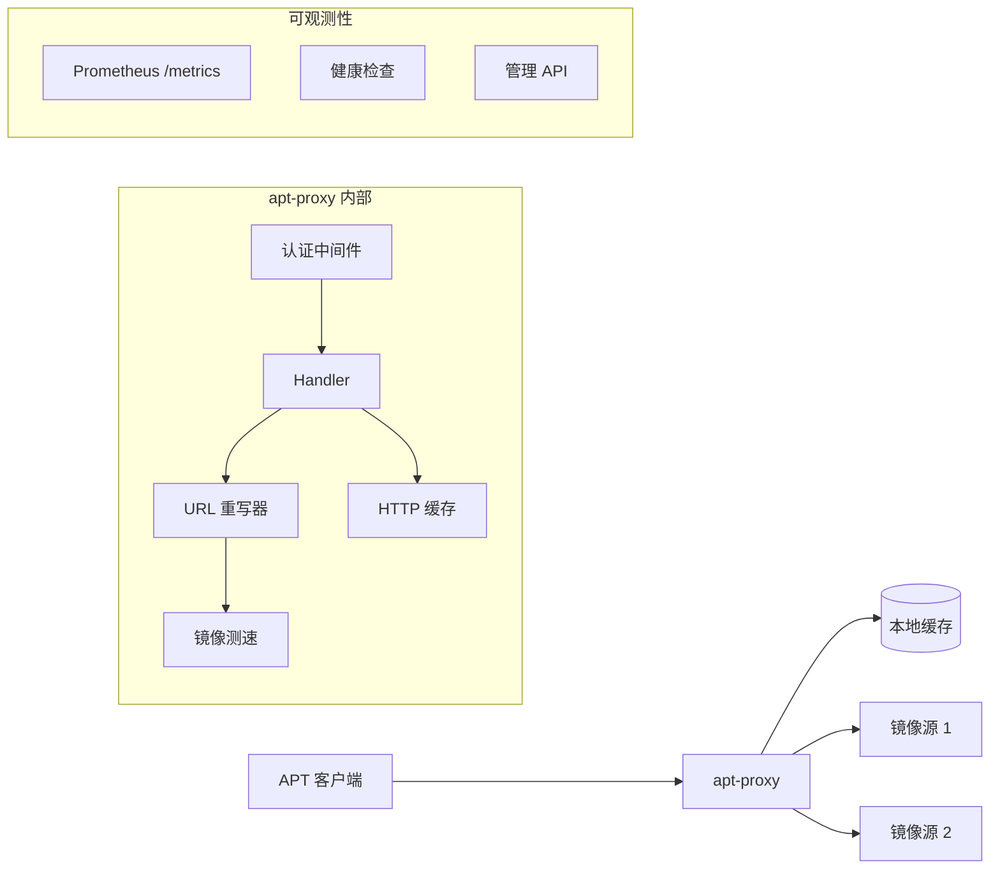

# APT Proxy / 轻量 APT 加速工具

[](https://github.com/soulteary/apt-proxy/actions/workflows/scan.yml) [](https://github.com/soulteary/apt-proxy/actions/workflows/release.yaml) [](https://goreportcard.com/report/github.com/soulteary/apt-proxy) [](https://hub.docker.com/r/soulteary/apt-proxy)

<p style="text-align: center;">
  <a href="README.md" target="_blank">ENGLISH</a> | <a href="README_CN.md">中文文档</a>
</p>


> 一个轻量级的 APT 缓存代理 - 仅仅只有 2MB 大小！


## 概述

APT Proxy 是一个轻量级、高性能的包管理器缓存代理。它通过在本地缓存常用软件包来加速下载，大幅减少后续安装的下载时间。无论你是管理多台服务器、构建 Docker 镜像，还是在带宽受限的环境中工作，APT Proxy 都能帮你节省时间和带宽。

### 核心特性

- **多发行版支持**：支持 APT（Ubuntu/Debian）、YUM（CentOS）和 APK（Alpine Linux）
- **轻量级**：二进制文件仅 2MB 左右，资源占用极低
- **智能镜像选择**：自动测试并选择最快的镜像源
- **Docker 友好**：无缝集成 Docker 容器和构建流程
- **即插即用**：兼容 [apt-cacher-ng](https://www.unix-ag.uni-kl.de/~bloch/acng/) 配置
- **零配置**：开箱即用，默认配置即可满足大多数场景
- **可观测性**：内置健康检查、Prometheus 指标和结构化日志
- **缓存管理**：REST API 支持缓存统计、清理和维护

## 支持的平台

- Linux：x86_64 / x86_32 / Ubuntu ARM64v8
- ARM：ARM64v8 / ARM32v6 / ARM32v7
- macOS：x86_64 / Apple Silicon (ARM64v8)

## 快速开始

### 安装

从 [releases 页面](https://github.com/soulteary/apt-proxy/releases) 下载适合你平台的最新版本，或使用 Docker：

```bash
docker pull soulteary/apt-proxy
```

### 运行 APT Proxy

直接运行二进制文件，无需配置：

```bash
./apt-proxy
```

你会看到类似以下的输出：

```
2024/01/15 10:30:00 INF starting apt-proxy version=1.0.0 listen=0.0.0.0:3142 protocol=http
2024/01/15 10:30:01 INF Starting benchmark for mirrors
2024/01/15 10:30:01 INF Finished benchmarking mirrors
2024/01/15 10:30:01 INF using fastest mirror mirror=https://mirrors.company.ltd/ubuntu/
2024/01/15 10:30:01 INF server started successfully
```

代理已经启动并准备好缓存软件包了。默认监听 `0.0.0.0:3142`，并自动选择最快的镜像源。

## 使用示例

### Ubuntu / Debian

通过设置 `http_proxy` 环境变量来配置系统使用代理：

```bash
# 更新软件包列表（首次运行会下载并缓存）
http_proxy=http://your-domain-or-ip-address:3142 \
  apt-get -o pkgProblemResolver=true -o Acquire::http=true update

# 安装软件包（后续安装将使用缓存的软件包）
http_proxy=http://your-domain-or-ip-address:3142 \
  apt-get -o pkgProblemResolver=true -o Acquire::http=true install vim -y
```

**提示**：为了方便，你可以在 shell 中导出代理设置：

```bash
export http_proxy=http://your-domain-or-ip-address:3142
apt-get update
apt-get install vim -y
```

首次下载后，所有后续的包操作都会显著加快，因为软件包从本地缓存提供。

### CentOS

APT Proxy 支持 YUM 仓库。配置你的 CentOS 系统使用代理：

**CentOS 7：**

```bash
# 配置仓库使用代理
cat /etc/yum.repos.d/CentOS-Base.repo | \
  sed -e s/mirrorlist.*$// \
      -e s/#baseurl/baseurl/ \
      -e s#http://mirror.centos.org#http://your-domain-or-ip-address:3142# | \
  tee /etc/yum.repos.d/CentOS-Base.repo

# 验证配置
yum update
```

**CentOS 8：**

```bash
# 更新所有 CentOS 仓库使用代理
sed -i -e "s#mirror.centos.org#http://your-domain-or-ip-address:3142#g" \
       -e "s/#baseurl/baseurl/" \
       -e "s#\$releasever/#8-stream/#" \
       /etc/yum.repos.d/CentOS-*

# 验证配置
yum update
```

### Alpine Linux

配置 Alpine 的 APK 包管理器使用代理：

```bash
# 更新仓库使用代理
cat /etc/apk/repositories | \
  sed -e s#https://.*.alpinelinux.org#http://your-domain-or-ip-address:3142# | \
  tee /etc/apk/repositories

# 验证配置
apk update
```

## 高级配置

### 发行版与镜像配置文件（distributions.yaml）

通过外部 YAML 文件可维护发行版和镜像列表，无需改代码或重新编译。

**配置文件路径（未指定时按以下顺序查找）：**

1. `./config/distributions.yaml`
2. `./distributions.yaml`
3. `/etc/apt-proxy/distributions.yaml`
4. `~/.config/apt-proxy/distributions.yaml`

也可通过 `--distributions-config` 或环境变量 `APT_PROXY_DISTRIBUTIONS_CONFIG` 显式指定路径。

**示例 `config/distributions.yaml`：**

```yaml
distributions:
  - id: ubuntu
    name: Ubuntu
    type: 1
    url_pattern: "/ubuntu/(.+)$"
    benchmark_url: "dists/noble/main/binary-amd64/Release"
    geo_mirror_api: "http://mirrors.ubuntu.com/mirrors.txt"
    cache_rules:
      - pattern: "deb$"
        cache_control: "max-age=100000"
        rewrite: true
    mirrors:
      official:
        - "mirrors.tuna.tsinghua.edu.cn/ubuntu/"
        - "mirrors.ustc.edu.cn/ubuntu/"
      custom:
        - "mirrors.163.com/ubuntu/"
    aliases:
      tsinghua: "mirrors.tuna.tsinghua.edu.cn/ubuntu/"
      ustc: "mirrors.ustc.edu.cn/ubuntu/"
```

修改配置后，发送 **SIGHUP** 或调用 **POST /api/mirrors/refresh** 即可热重载，无需重启。

**添加或修改发行版：** 在 `distributions` 下增加或编辑一项，填写 `id`、`name`、`type`、`url_pattern`、`benchmark_url`、`cache_rules`、`mirrors`、`aliases` 即可。本仓库自带示例 `config/distributions.yaml`，可直接在此基础上增删改。

### 自定义镜像选择

默认情况下，APT Proxy 会自动测试可用镜像并选择最快的一个。但如果需要，你可以指定自定义镜像。

**使用完整 URL：**

```bash
# 同时缓存多个发行版
./apt-proxy \
  --ubuntu=https://mirrors.tuna.tsinghua.edu.cn/ubuntu/ \
  --debian=https://mirrors.tuna.tsinghua.edu.cn/debian/

# 仅缓存 Ubuntu 软件包（减少内存占用）
./apt-proxy --mode=ubuntu --ubuntu=https://mirrors.tuna.tsinghua.edu.cn/ubuntu/

# 仅缓存 Debian 软件包
./apt-proxy --mode=debian --debian=https://mirrors.tuna.tsinghua.edu.cn/debian/
```

**使用镜像快捷方式：**

为了方便，你可以使用预定义的快捷方式代替完整 URL：

```bash
./apt-proxy --ubuntu=cn:tsinghua --debian=cn:163
```

**可用的快捷方式：**

- `cn:tsinghua` - 清华大学镜像
- `cn:ustc` - 中科大镜像
- `cn:163` - 网易镜像
- `cn:aliyun` - 阿里云镜像
- `cn:huaweicloud` - 华为云镜像
- `cn:tencent` - 腾讯云镜像

输出示例：

```
2024/01/15 10:55:26 INF starting apt-proxy version=1.0.0
2024/01/15 10:55:26 INF using specified debian mirror mirror=https://mirrors.163.com/debian/
2024/01/15 10:55:26 INF using specified ubuntu mirror mirror=https://mirrors.tuna.tsinghua.edu.cn/ubuntu/
2024/01/15 10:55:26 INF proxy listening on 0.0.0.0:3142
2024/01/15 10:55:26 INF server started successfully
```

## Docker 集成

### 在 Docker 中运行 APT Proxy

将 APT Proxy 部署为 Docker 容器：

```bash
docker run -d \
  --name=apt-proxy \
  -p 3142:3142 \
  -v apt-proxy-cache:/app/.aptcache \
  soulteary/apt-proxy
```

`-v apt-proxy-cache:/app/.aptcache` 选项可以在容器重启后保留缓存。

### 在 Docker 构建中使用 APT Proxy

加速 Docker 容器中的软件包安装：

```bash
# 启动容器（Ubuntu 或 Debian）
docker run --rm -it ubuntu

# 在容器内使用代理
http_proxy=http://host.docker.internal:3142 \
  apt-get -o Debug::pkgProblemResolver=true -o Acquire::http=true update

http_proxy=http://host.docker.internal:3142 \
  apt-get -o Debug::pkgProblemResolver=true -o Acquire::http=true install vim -y
```

**注意**：`host.docker.internal` 在 Docker Desktop 上有效。对于 Linux，请使用主机的 IP 地址或适当配置 Docker 网络。

### Docker Compose 示例

查看 [example 目录](example/) 获取完整的 Docker Compose 配置。

## 配置选项

查看所有可用选项：

```bash
./apt-proxy -h
```

**可用选项：**

| 选项 | 描述 | 默认值 |
|------|------|--------|
| `-host` | 绑定的网络接口 | `0.0.0.0` |
| `-port` | 监听端口 | `3142` |
| `-mode` | 发行版模式：`all`、`ubuntu`、`ubuntu-ports`、`debian`、`centos`、`alpine` | `all` |
| `-cachedir` | 缓存目录 | `./.aptcache` |
| `-ubuntu` | Ubuntu 镜像 URL 或快捷方式 | （自动选择） |
| `-ubuntu-ports` | Ubuntu Ports 镜像 URL 或快捷方式 | （自动选择） |
| `-debian` | Debian 镜像 URL 或快捷方式 | （自动选择） |
| `-centos` | CentOS 镜像 URL 或快捷方式 | （自动选择） |
| `-alpine` | Alpine 镜像 URL 或快捷方式 | （自动选择） |
| `-distributions-config` | 发行版/镜像配置文件路径（distributions.yaml） | （可选） |
| `-cache-max-size` | 最大缓存大小（GB，0 表示禁用） | `10` |
| `-cache-ttl` | 缓存 TTL（小时，0 表示禁用） | `168`（7 天） |
| `-cache-cleanup-interval` | 缓存清理间隔（分钟） | `60` |
| `-tls` | 启用 TLS/HTTPS | `false` |
| `-tls-cert` | TLS 证书文件路径 | |
| `-tls-key` | TLS 私钥文件路径 | |
| `-api-key` | 受保护端点的 API 密钥 | |
| `-config` | YAML 配置文件路径 | |
| `-debug` | 启用详细调试日志 | `false` |

**自定义配置示例：**

```bash
./apt-proxy \
  --host=0.0.0.0 \
  --port=3142 \
  --cachedir=/var/cache/apt-proxy \
  --mode=ubuntu \
  --ubuntu=cn:tsinghua \
  --cache-max-size=20 \
  --debug
```

### YAML 配置文件

APT Proxy 支持 YAML 配置文件，适用于更复杂的配置场景。创建名为 `apt-proxy.yaml` 的文件：

```yaml
server:
  host: 0.0.0.0
  port: 3142
  debug: false

cache:
  dir: /var/cache/apt-proxy
  max_size_gb: 20
  ttl_hours: 168
  cleanup_interval_min: 60

mirrors:
  ubuntu: cn:tsinghua
  debian: cn:ustc

tls:
  enabled: false
  cert_file: /etc/ssl/certs/apt-proxy.crt
  key_file: /etc/ssl/private/apt-proxy.key

security:
  api_key: ${APT_PROXY_API_KEY}  # 支持环境变量展开
  enable_api_auth: true

mode: all
```

**配置优先级：** CLI 参数 > 环境变量 > 配置文件 > 默认值

**配置文件搜索路径（按顺序）：**
1. 通过 `-config` 参数或 `APT_PROXY_CONFIG_FILE` 环境变量指定的路径
2. `./apt-proxy.yaml`（当前目录）
3. `/etc/apt-proxy/apt-proxy.yaml`（系统配置）
4. `~/.config/apt-proxy/apt-proxy.yaml`（用户配置）
5. `~/.apt-proxy.yaml`（用户配置）

### 缓存容量与淘汰策略

缓存支持通过 `max_size_gb`（YAML）、`--cache-max-size`（CLI）或 `APT_PROXY_CACHE_MAX_SIZE`（环境变量）设置容量上限。当总缓存大小超过该限制时，代理会按 **最久未访问**（LRU）自动删除文件，直至总容量保持在限制以内。淘汰会在写入新条目时以及定期清理时执行。

- 设置为正整数（如 `20` 表示 20 GB）可启用容量限制与 LRU 淘汰。
- 设置为 `0` 表示不限制容量，不进行按容量淘汰。

进程重启后，在尚未有新访问之前，LRU 顺序按文件修改时间近似。

## API 端点

APT Proxy 提供 REST API 端点用于监控和管理：

### 健康检查与监控

| 端点 | 描述 |
|------|------|
| `GET /healthz` | 综合健康检查 |
| `GET /livez` | Kubernetes 存活探针 |
| `GET /readyz` | Kubernetes 就绪探针 |
| `GET /version` | 版本信息 |
| `GET /metrics` | Prometheus 指标 |

### 缓存管理（受保护）

| 端点 | 方法 | 描述 |
|------|------|------|
| `/api/cache/stats` | GET | 缓存统计（大小、命中率、条目数） |
| `/api/cache/purge` | POST | 清除所有缓存 |
| `/api/cache/cleanup` | POST | 移除过期缓存条目 |

### 镜像管理（受保护）

| 端点 | 方法 | 描述 |
|------|------|------|
| `/api/mirrors/refresh` | POST | 重载发行版/镜像配置（distributions.yaml）并刷新镜像 |

### API 认证

配置 API 密钥后，所有管理端点都需要认证。可通过以下方式提供 API 密钥：

1. **X-API-Key Header**（推荐）：
   ```bash
   curl -H "X-API-Key: your-api-key" http://localhost:3142/api/cache/stats
   ```

2. **Authorization Bearer Token**：
   ```bash
   curl -H "Authorization: Bearer your-api-key" http://localhost:3142/api/cache/stats
   ```

**示例：获取缓存统计（带认证）**

```bash
curl -H "X-API-Key: your-api-key" http://localhost:3142/api/cache/stats
```

响应：

```json
{
  "total_size_bytes": 1073741824,
  "total_size_human": "1.00 GB",
  "item_count": 150,
  "stale_count": 5,
  "hit_count": 1250,
  "miss_count": 150,
  "hit_rate": 0.893
}
```

## 热重载

APT Proxy 仅支持对**发行版与镜像配置**（含 `distributions.yaml`）热重载，无需重启。**主配置**（如 `apt-proxy.yaml`：服务 host/port、缓存限制、TLS、安全、API Key 等）**不会**热重载，修改后需重启进程。

重载发行版与镜像：

```bash
# 发送 SIGHUP 信号重载配置并刷新镜像
kill -HUP $(pgrep apt-proxy)
```

或使用 API：

```bash
curl -X POST http://localhost:3142/api/mirrors/refresh
```

## 可观测性与指标

`/metrics` 端点暴露 Prometheus 指标。主要指标与建议告警：

| 指标/范围 | 说明 | 建议告警 |
|----------|------|----------|
| `apt_proxy_cache_*` | 缓存命中/未命中、大小、条目数、驱逐、清理耗时 | 缓存错误率过高；缓存接近上限 |
| `apt_proxy_cache_upstream_*` | 上游请求耗时与错误 | 上游 5xx 或超时率过高 |
| `apt_proxy_cache_request_duration_seconds` | 按发行版与缓存命中的请求延迟 | 请求延迟 P99 超阈值 |
| 健康检查（`/healthz`、`/readyz`） | 服务与依赖健康 | 健康检查失败 |

运行测试与覆盖率：`go test -cover ./...`；生成报告：`go test -coverprofile=coverage.out ./...` 与 `go tool cover -html=coverage.out`。

## 架构



### 请求流程

1. **客户端请求**：APT 客户端发送包请求到 apt-proxy
2. **缓存检查**：Handler 检查包是否存在于本地缓存
3. **缓存命中**：如果已缓存且未过期，立即从缓存返回
4. **缓存未命中**：将 URL 重写到最快镜像，从上游获取
5. **存储并响应**：缓存响应并返回给客户端

## 项目结构

```
apt-proxy/
├── cmd/
│   └── apt-proxy/            # 应用入口
│       └── main.go           # 主入口
├── internal/                 # 私有应用代码
│   ├── api/                  # REST API 处理器
│   │   ├── auth.go           # API 认证中间件
│   │   ├── cache.go          # 缓存管理端点
│   │   ├── mirrors.go        # 镜像管理端点
│   │   └── response.go       # 响应工具
│   ├── benchmarks/           # 镜像基准测试（同步和异步）
│   ├── cli/                  # CLI 和守护进程管理
│   │   ├── cli.go            # 配置解析和重新导出
│   │   └── daemon.go         # 服务器生命周期管理
│   ├── config/               # 配置管理
│   │   ├── config.go         # 配置结构
│   │   ├── defaults.go       # 默认值
│   │   └── loader.go         # 配置加载（CLI、ENV、YAML）
│   ├── distro/               # 发行版定义
│   │   ├── distro.go         # 通用类型和工具
│   │   ├── ubuntu.go         # Ubuntu 配置
│   │   ├── debian.go         # Debian 配置
│   │   ├── centos.go         # CentOS 配置
│   │   └── alpine.go         # Alpine 配置
│   ├── errors/               # 统一错误处理
│   │   └── errors.go         # 错误码和类型
│   ├── mirrors/              # 镜像管理
│   ├── proxy/                # 核心代理功能
│   │   ├── handler.go        # HTTP 请求处理
│   │   ├── rewriter.go       # URL 重写
│   │   ├── page.go           # 首页渲染
│   │   └── stats.go          # 统计信息
│   ├── state/                # 应用状态管理
│   └── system/               # 系统工具（磁盘、GC、文件大小）
├── pkg/                      # 可复用包（可被其他项目导入）
│   └── httpcache/            # HTTP 缓存层（含指标，使用 github.com/soulteary/vfs-kit）
├── tests/                    # 集成测试
│   └── integration/          # 端到端测试
└── docker/, example/, docs/  # 部署和文档
```

## 开发

### 从源码构建

```bash
git clone https://github.com/soulteary/apt-proxy.git
cd apt-proxy
go build -o apt-proxy ./cmd/apt-proxy
```

与 [vfs-kit](https://github.com/soulteary/vfs-kit) 联合开发时，`go.mod` 可使用 `replace` 指向本地 `../kits/vfs-kit`；使用已发布的 vfs-kit 版本时请移除该 replace。

### 运行测试

```bash
# 运行所有测试并显示覆盖率
go test -cover ./...

# 生成详细的覆盖率报告
go test -coverprofile=coverage.out ./...
go tool cover -html=coverage.out
```

### 贡献代码

欢迎贡献！请随时提交 Pull Request。

## 故障排除

### 调试模式

启用调试日志来排查问题：

```bash
./apt-proxy --debug
```

### 调试包操作

对于 Ubuntu/Debian 包管理器操作的详细调试：

```bash
# 启用详细调试
http_proxy=http://192.168.33.1:3142 \
  apt-get -o Debug::pkgProblemResolver=true \
          -o Debug::Acquire::http=true \
          update

http_proxy=http://192.168.33.1:3142 \
  apt-get -o Debug::pkgProblemResolver=true \
          -o Debug::Acquire::http=true \
          install apache2
```

### 常见问题

**问题**：软件包没有被缓存
**解决方案**：确保代理 URL 配置正确，并且客户端机器可以访问。

**问题**：首次下载很慢
**解决方案**：这是预期行为 - 首次下载会填充缓存。后续下载会更快。

**问题**：缓存目录过大
**解决方案**：使用 `--cache-max-size` 配置缓存限制，或使用清理 API 端点。

## 开源协议

本项目基于 [Apache License 2.0](https://github.com/soulteary/apt-proxy/blob/master/LICENSE) 协议。

## 致谢

本项目基于以下优秀项目构建：

- [lox/apt-proxy](https://github.com/lox/apt-proxy) - 原始 APT 代理实现
- [lox/httpcache](https://github.com/lox/httpcache) - HTTP 缓存库（MIT License）
- [djherbis/stream](https://github.com/djherbis/stream) - 流处理库（MIT License）
- [soulteary/vfs-kit](https://github.com/soulteary/vfs-kit) - 虚拟文件系统库（源自 rainycape/vfs，Mozilla Public License 2.0）

## 支持

- **问题反馈**：[GitHub Issues](https://github.com/soulteary/apt-proxy/issues)
- **讨论交流**：[GitHub Discussions](https://github.com/soulteary/apt-proxy/discussions)

---

由 APT Proxy 社区用 ❤️ 打造
