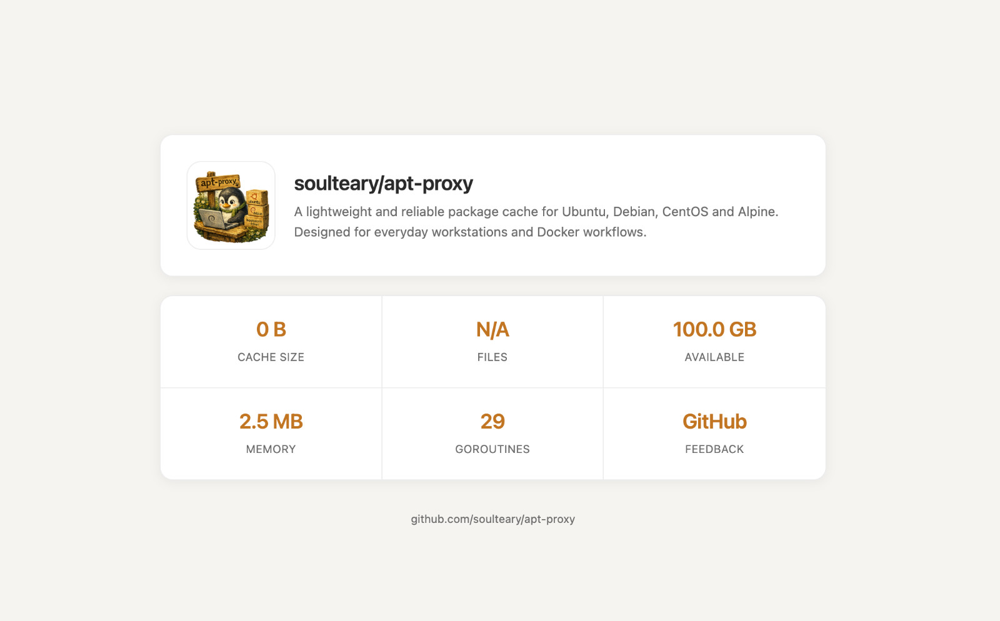
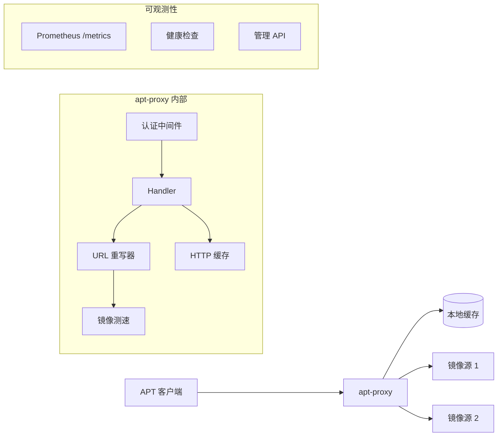

# APT Proxy / 轻量 APT 加速工具

[](https://github.com/soulteary/apt-proxy/actions/workflows/scan.yml) [](https://github.com/soulteary/apt-proxy/actions/workflows/release.yaml) [](https://goreportcard.com/report/github.com/soulteary/apt-proxy) [](https://hub.docker.com/r/soulteary/apt-proxy)

<p style="text-align: center;">
  <a href="README.md" target="_blank">ENGLISH</a> | <a href="README_CN.md">中文文档</a>
</p>

<p align="center">
  
</p>

> 一个轻量级的 APT 缓存代理 - 仅仅不到 10MB 大小！

<p align="center">
  
</p>

## 概述

APT Proxy 是一个轻量级、高性能的包管理器缓存代理。它通过在本地缓存常用软件包来加速下载，大幅减少后续安装的下载时间。无论你是管理多台服务器、构建 Docker 镜像，还是在带宽受限的环境中工作，APT Proxy 都能帮你节省时间和带宽。

<p align="center">
  
</p>

### 核心特性

- **多发行版支持**：支持 APT（Ubuntu/Debian）、YUM（CentOS）和 APK（Alpine Linux）
- **轻量级**：二进制文件不到 10MB，资源占用极低
- **智能镜像选择**：自动测试并选择最快的镜像源
- **Docker 友好**：无缝集成 Docker 容器和构建流程
- **即插即用**：兼容 [apt-cacher-ng](https://www.unix-ag.uni-kl.de/~bloch/acng/) 配置
- **零配置**：开箱即用，默认配置即可满足大多数场景
- **可观测性**：内置健康检查、Prometheus 指标、结构化日志，并可选启用 OpenTelemetry 链路追踪
- **缓存管理**：REST API 支持缓存统计、清理与维护，附带 API Key 鉴权与按 IP 限流

## 支持的平台

- Linux：x86_64 / x86_32 / Ubuntu ARM64v8
- ARM：ARM64v8 / ARM32v6 / ARM32v7
- macOS：x86_64 / Apple Silicon (ARM64v8)

## 快速开始

### 安装

从 [releases 页面](https://github.com/soulteary/apt-proxy/releases) 下载适合你平台的最新版本，或使用 Docker：

```bash
docker pull soulteary/apt-proxy
```

### 运行 APT Proxy

直接运行二进制文件，无需配置：

```bash
./apt-proxy
```

你会看到类似以下的输出：

```
2024/01/15 10:30:00 INF starting apt-proxy version=1.0.0 listen=0.0.0.0:3142 protocol=http
2024/01/15 10:30:01 INF Starting benchmark for mirrors
2024/01/15 10:30:01 INF Finished benchmarking mirrors
2024/01/15 10:30:01 INF using fastest mirror mirror=https://mirrors.company.ltd/ubuntu/
2024/01/15 10:30:01 INF server started successfully
```

代理已经启动并准备好缓存软件包了。默认监听 `0.0.0.0:3142`，并自动选择最快的镜像源。

## 使用示例

### Ubuntu / Debian

通过设置 `http_proxy` 环境变量来配置系统使用代理：

```bash
# 更新软件包列表（首次运行会下载并缓存）
http_proxy=http://your-domain-or-ip-address:3142 \
  apt-get -o pkgProblemResolver=true -o Acquire::http=true update

# 安装软件包（后续安装将使用缓存的软件包）
http_proxy=http://your-domain-or-ip-address:3142 \
  apt-get -o pkgProblemResolver=true -o Acquire::http=true install vim -y
```

**提示**：为了方便，你可以在 shell 中导出代理设置：

```bash
export http_proxy=http://your-domain-or-ip-address:3142
apt-get update
apt-get install vim -y
```

首次下载后，所有后续的包操作都会显著加快，因为软件包从本地缓存提供。

### CentOS

APT Proxy 支持 YUM 仓库。配置你的 CentOS 系统使用代理：

**CentOS 7：**

```bash
# 配置仓库使用代理
cat /etc/yum.repos.d/CentOS-Base.repo | \
  sed -e s/mirrorlist.*$// \
      -e s/#baseurl/baseurl/ \
      -e s#http://mirror.centos.org#http://your-domain-or-ip-address:3142# | \
  tee /etc/yum.repos.d/CentOS-Base.repo

# 验证配置
yum update
```

**CentOS 8：**

```bash
# 更新所有 CentOS 仓库使用代理
sed -i -e "s#mirror.centos.org#http://your-domain-or-ip-address:3142#g" \
       -e "s/#baseurl/baseurl/" \
       -e "s#\$releasever/#8-stream/#" \
       /etc/yum.repos.d/CentOS-*

# 验证配置
yum update
```

### Alpine Linux

配置 Alpine 的 APK 包管理器使用代理：

```bash
# 更新仓库使用代理
cat /etc/apk/repositories | \
  sed -e s#https://.*.alpinelinux.org#http://your-domain-or-ip-address:3142# | \
  tee /etc/apk/repositories

# 验证配置
apk update
```

## 高级配置

### 发行版与镜像配置文件（distributions.yaml）

通过外部 YAML 文件可维护发行版和镜像列表，无需改代码或重新编译。

**配置文件路径（未指定时按以下顺序查找）：**

1. `./config/distributions.yaml`
2. `./distributions.yaml`
3. `/etc/apt-proxy/distributions.yaml`
4. `~/.config/apt-proxy/distributions.yaml`

也可通过 `--distributions-config` 或环境变量 `APT_PROXY_DISTRIBUTIONS_CONFIG` 显式指定路径。

**示例 `config/distributions.yaml`：**

```yaml
distributions:
  - id: ubuntu
    name: Ubuntu
    type: 1
    url_pattern: "/ubuntu/(.+)$"
    benchmark_url: "dists/noble/main/binary-amd64/Release"
    geo_mirror_api: "http://mirrors.ubuntu.com/mirrors.txt"
    cache_rules:
      - pattern: "deb$"
        cache_control: "max-age=100000"
        rewrite: true
    mirrors:
      official:
        - "mirrors.tuna.tsinghua.edu.cn/ubuntu/"
        - "mirrors.ustc.edu.cn/ubuntu/"
      custom:
        - "mirrors.163.com/ubuntu/"
    aliases:
      tsinghua: "mirrors.tuna.tsinghua.edu.cn/ubuntu/"
      ustc: "mirrors.ustc.edu.cn/ubuntu/"
```

修改配置后，发送 **SIGHUP** 或调用 **POST /api/mirrors/refresh** 即可热重载，无需重启。

**字段说明：**

- `id` — 唯一标识符，用作 URL 前缀（`/<id>/...`）。
- `name` — 显示名。
- `type` — 整数类型：`1` Ubuntu、`2` UbuntuPorts、`3` Debian、`4` CentOS、`5` Alpine（`0` 保留给 "all"）。
- `url_pattern` — 用于匹配请求路径的正则；捕获的部分会拼到上游镜像后。
- `benchmark_url` — 镜像测速用的相对路径。
- `geo_mirror_api` — 可选，返回地理镜像列表（Ubuntu 风格的 `mirrors.txt`）。
- `cache_rules[]` — 按规则注入 `Cache-Control`（仅对 `200`/`404` 响应生效），以及是否对该模式做 URL 重写。
- `mirrors.official` / `mirrors.custom` — 镜像主机列表。基于主机末段会自动生成 `cn:<name>` 形式的别名（如 `mirrors.tuna.tsinghua.edu.cn` → `cn:tsinghua`）。
- `aliases` — 显式别名映射，可覆盖/补充自动生成的别名。

**添加或修改发行版：** 在 `distributions` 下增加或编辑一项，填写 `id`、`name`、`type`、`url_pattern`、`benchmark_url`、`cache_rules`、`mirrors`、`aliases` 即可。本仓库自带示例 `config/distributions.yaml`，可直接在此基础上增删改。

### 自定义镜像选择

默认情况下，APT Proxy 会自动测试可用镜像并选择最快的一个。但如果需要，你可以指定自定义镜像。

**使用完整 URL：**

```bash
# 同时缓存多个发行版
./apt-proxy \
  --ubuntu=https://mirrors.tuna.tsinghua.edu.cn/ubuntu/ \
  --debian=https://mirrors.tuna.tsinghua.edu.cn/debian/

# 仅缓存 Ubuntu 软件包（减少内存占用）
./apt-proxy --mode=ubuntu --ubuntu=https://mirrors.tuna.tsinghua.edu.cn/ubuntu/

# 仅缓存 Debian 软件包
./apt-proxy --mode=debian --debian=https://mirrors.tuna.tsinghua.edu.cn/debian/
```

**使用镜像快捷方式：**

为了方便，你可以使用预定义的快捷方式代替完整 URL：

```bash
./apt-proxy --ubuntu=cn:tsinghua --debian=cn:163
```

**可用的快捷方式：**

- `cn:tsinghua` - 清华大学镜像
- `cn:ustc` - 中科大镜像
- `cn:163` - 网易镜像
- `cn:aliyun` - 阿里云镜像
- `cn:huaweicloud` - 华为云镜像
- `cn:tencent` - 腾讯云镜像

输出示例：

```
2024/01/15 10:55:26 INF starting apt-proxy version=1.0.0
2024/01/15 10:55:26 INF using specified debian mirror mirror=https://mirrors.163.com/debian/
2024/01/15 10:55:26 INF using specified ubuntu mirror mirror=https://mirrors.tuna.tsinghua.edu.cn/ubuntu/
2024/01/15 10:55:26 INF proxy listening on 0.0.0.0:3142
2024/01/15 10:55:26 INF server started successfully
```

## Docker 集成

### 在 Docker 中运行 APT Proxy

将 APT Proxy 部署为 Docker 容器：

```bash
docker run -d \
  --name=apt-proxy \
  -p 3142:3142 \
  -v apt-proxy-cache:/app/.aptcache \
  soulteary/apt-proxy
```

`-v apt-proxy-cache:/app/.aptcache` 选项可以在容器重启后保留缓存。

### 在 Docker 构建中使用 APT Proxy

加速 Docker 容器中的软件包安装：

```bash
# 启动容器（Ubuntu 或 Debian）
docker run --rm -it ubuntu

# 在容器内使用代理
http_proxy=http://host.docker.internal:3142 \
  apt-get -o Debug::pkgProblemResolver=true -o Acquire::http=true update

http_proxy=http://host.docker.internal:3142 \
  apt-get -o Debug::pkgProblemResolver=true -o Acquire::http=true install vim -y
```

**注意**：`host.docker.internal` 在 Docker Desktop 上有效。对于 Linux，请使用主机的 IP 地址或适当配置 Docker 网络。

### Docker Compose 示例

查看 [examples 目录](examples/) 获取完整的 Docker Compose 配置。其中包含四个自包含的子示例：[`basic/`](examples/basic/)（最小部署）、[`specify-mirrors/`](examples/specify-mirrors/)（指定上游镜像）、[`s3-minio/`](examples/s3-minio/)（缓存落到 S3 兼容对象存储）、[`config-template/`](examples/config-template/)（带详尽注释的 `apt-proxy.yaml` 参考）。

## 配置选项

查看所有可用选项：

```bash
./apt-proxy -h
```

**可用选项：**

| 选项 | 描述 | 默认值 |
|------|------|--------|
| `-host` | 绑定的网络接口 | `0.0.0.0` |
| `-port` | 监听端口 | `3142` |
| `-mode` | 发行版模式：`all`、`ubuntu`、`ubuntu-ports`、`debian`、`centos`、`alpine` | `all` |
| `-cachedir` | 缓存目录 | `./.aptcache` |
| `-ubuntu` | Ubuntu 镜像 URL 或快捷方式 | （自动选择） |
| `-ubuntu-ports` | Ubuntu Ports 镜像 URL 或快捷方式 | （自动选择） |
| `-debian` | Debian 镜像 URL 或快捷方式 | （自动选择） |
| `-centos` | CentOS 镜像 URL 或快捷方式 | （自动选择） |
| `-alpine` | Alpine 镜像 URL 或快捷方式 | （自动选择） |
| `-distributions-config` | 发行版/镜像配置文件路径（distributions.yaml） | （可选） |
| `-cache-max-size` | 最大缓存大小（GB，0 表示禁用） | `10` |
| `-cache-ttl` | 缓存 TTL（小时，0 表示禁用） | `168`（7 天） |
| `-cache-cleanup-interval` | 缓存清理间隔（分钟） | `60` |
| `-tls` | 启用 TLS/HTTPS（需同时提供 `-tls-cert` 与 `-tls-key`） | `false` |
| `-tls-cert` | TLS 证书文件路径 | |
| `-tls-key` | TLS 私钥文件路径 | |
| `-api-key` | 受保护端点的 API 密钥（设置后自动启用鉴权） | |
| `-enable-api-auth` | 显式开/关 API 鉴权中间件 | `false`（设置 `-api-key` 时自动变为 `true`） |
| `-api-rate-limit` | 每 IP 每分钟的 API 请求数（`0` 关闭） | `60` |
| `-trusted-proxies` | 受信任代理 CIDR 列表（逗号分隔），仅对其匹配的请求解析 `X-Forwarded-For` | |
| `-upstream-keep-alive` | 上游 HTTP keep-alive（仅 CLI/ENV 生效，YAML 不可配置） | `true` |
| `-storage-backend` | 缓存存储后端：`disk` 或 `s3` | `disk` |
| `-s3-endpoint` | S3 endpoint（`host[:port]`，不含协议前缀） | |
| `-s3-region` | S3 region（AWS 必填，多数 MinIO 服务可留空） | |
| `-s3-bucket` | S3 bucket 名称 | |
| `-s3-prefix` | bucket 内 key 前缀 | `apt-proxy/` |
| `-s3-access-key` | S3 access key（建议改用 ENV） | |
| `-s3-secret-key` | S3 secret key（建议改用 ENV） | |
| `-s3-session-token` | 临时凭证 session token（可选） | |
| `-s3-use-ssl` | 与 S3 通信使用 HTTPS | `true` |
| `-s3-use-path-style` | 强制 path-style 寻址（MinIO/Ceph 必须开启） | `false` |
| `-s3-inline-max-mb` | 内存缓冲上传阈值（MiB），超过则落盘后再 PUT | `32` |
| `-s3-temp-dir` | 大对象上传时使用的临时目录 | （`os.TempDir()`） |
| `-config` | YAML 配置文件路径 | |
| `-debug` | 启用详细调试日志（同时把请求 header/body 打印到日志） | `false` |

**自定义配置示例：**

```bash
./apt-proxy \
  --host=0.0.0.0 \
  --port=3142 \
  --cachedir=/var/cache/apt-proxy \
  --mode=ubuntu \
  --ubuntu=cn:tsinghua \
  --cache-max-size=20 \
  --debug
```

### 环境变量

每个 CLI 参数都有等价的环境变量。此外还有几个仅环境变量提供的开关，用于日志与链路追踪。

**服务/模式**

| 变量名 | 等价 CLI 参数 | 说明 |
|--------|--------------|------|
| `APT_PROXY_HOST` | `-host` | 监听的网络接口 |
| `APT_PROXY_PORT` | `-port` | 监听端口 |
| `APT_PROXY_MODE` | `-mode` | 发行版模式（`all`/`ubuntu`/`ubuntu-ports`/`debian`/`centos`/`alpine`） |
| `APT_PROXY_DEBUG` | `-debug` | 启用详细调试日志 |
| `APT_PROXY_UBUNTU` | `-ubuntu` | Ubuntu 镜像 URL 或快捷方式 |
| `APT_PROXY_UBUNTU_PORTS` | `-ubuntu-ports` | Ubuntu Ports 镜像 |
| `APT_PROXY_DEBIAN` | `-debian` | Debian 镜像 |
| `APT_PROXY_CENTOS` | `-centos` | CentOS 镜像 |
| `APT_PROXY_ALPINE` | `-alpine` | Alpine 镜像 |
| `APT_PROXY_UPSTREAM_KEEP_ALIVE` | `-upstream-keep-alive` | 上游 HTTP keep-alive |

**缓存**

| 变量名 | 等价 CLI 参数 | 说明 |
|--------|--------------|------|
| `APT_PROXY_CACHEDIR` | `-cachedir` | 缓存目录 |
| `APT_PROXY_CACHE_MAX_SIZE` | `-cache-max-size` | 最大缓存大小（GB，`0` 禁用） |
| `APT_PROXY_CACHE_TTL` | `-cache-ttl` | 缓存 TTL（小时，`0` 禁用） |
| `APT_PROXY_CACHE_CLEANUP_INTERVAL` | `-cache-cleanup-interval` | 缓存清理间隔（分钟，`0` 禁用） |

**存储后端 / S3**

| 变量名 | 等价 CLI 参数 | 说明 |
|--------|--------------|------|
| `APT_PROXY_STORAGE_BACKEND` | `-storage-backend` | `disk` 或 `s3` |
| `APT_PROXY_S3_ENDPOINT` | `-s3-endpoint` | S3 endpoint，如 `s3.amazonaws.com` 或 `minio:9000` |
| `APT_PROXY_S3_REGION` | `-s3-region` | S3 region |
| `APT_PROXY_S3_BUCKET` | `-s3-bucket` | bucket 名称 |
| `APT_PROXY_S3_PREFIX` | `-s3-prefix` | key 前缀（默认 `apt-proxy/`） |
| `APT_PROXY_S3_ACCESS_KEY` | `-s3-access-key` | access key（**推荐**通过 ENV 注入） |
| `APT_PROXY_S3_SECRET_KEY` | `-s3-secret-key` | secret key（**推荐**通过 ENV 注入） |
| `APT_PROXY_S3_SESSION_TOKEN` | `-s3-session-token` | STS 临时 session token |
| `APT_PROXY_S3_USE_SSL` | `-s3-use-ssl` | 是否使用 HTTPS |
| `APT_PROXY_S3_USE_PATH_STYLE` | `-s3-use-path-style` | path-style 寻址（MinIO/Ceph 必须） |
| `APT_PROXY_S3_INLINE_MAX_MB` | `-s3-inline-max-mb` | 内存缓冲阈值（MiB） |
| `APT_PROXY_S3_TEMP_DIR` | `-s3-temp-dir` | 大对象临时目录 |

**TLS**

| 变量名 | 等价 CLI 参数 | 说明 |
|--------|--------------|------|
| `APT_PROXY_TLS_ENABLED` | `-tls` | 启用 TLS/HTTPS |
| `APT_PROXY_TLS_CERT` | `-tls-cert` | TLS 证书文件路径 |
| `APT_PROXY_TLS_KEY` | `-tls-key` | TLS 私钥文件路径 |

**安全 / API**

| 变量名 | 等价 CLI 参数 | 说明 |
|--------|--------------|------|
| `APT_PROXY_API_KEY` | `-api-key` | 受保护端点的 API 密钥 |
| `APT_PROXY_ENABLE_API_AUTH` | `-enable-api-auth` | 显式开关 API 鉴权 |
| `APT_PROXY_API_RATE_LIMIT_PER_MINUTE` | `-api-rate-limit` | 每 IP 每分钟 API 请求数（`0` 禁用） |
| `APT_PROXY_TRUSTED_PROXIES` | `-trusted-proxies` | 受信任代理 CIDR 列表 |

**配置文件**

| 变量名 | 等价 CLI 参数 | 说明 |
|--------|--------------|------|
| `APT_PROXY_CONFIG_FILE` | `-config` | `apt-proxy.yaml` 路径 |
| `APT_PROXY_DISTRIBUTIONS_CONFIG` | `-distributions-config` | `distributions.yaml` 路径 |

**日志与链路追踪**（无对应 CLI 参数）

| 变量名 | 说明 |
|--------|------|
| `APT_PROXY_LOG_LEVEL` | 日志级别：`debug` / `info` / `warn` / `error`。`--debug` 会强制为 `debug` |
| `APT_PROXY_LOG_FORMAT` | 日志格式：`json` / `console` / `auto`（auto 根据 stdout 是否为 TTY 自动选择） |
| `LOG_LEVEL` | 旧版别名；仅在未设置 `APT_PROXY_LOG_LEVEL` 时使用 |
| `LOG_FORMAT` | 旧版别名；仅在未设置 `APT_PROXY_LOG_FORMAT` 时使用 |
| `OTEL_EXPORTER_OTLP_ENDPOINT` | 设置后启用 OpenTelemetry 链路追踪并通过 OTLP 上报；优雅退出时自动 flush |

**配置优先级：** CLI 参数 > 环境变量 > 配置文件 > 默认值

### YAML 配置文件

APT Proxy 支持 YAML 配置文件，适用于更复杂的配置场景。创建名为 `apt-proxy.yaml` 的文件：

```yaml
server:
  host: 0.0.0.0
  port: 3142
  debug: false

cache:
  dir: /var/cache/apt-proxy
  max_size_gb: 20
  ttl_hours: 168
  cleanup_interval_min: 60

# 可选：将缓存改为 S3 兼容对象存储；backend 为 "disk" 时下面的 s3 字段被忽略
storage:
  backend: disk        # "disk"（默认）或 "s3"
  s3:
    endpoint: ""
    region: ""
    bucket: ""
    prefix: apt-proxy/
    access_key: ""
    secret_key: ""
    use_ssl: true
    use_path_style: false
    inline_max_mb: 32
    temp_dir: ""

mirrors:
  ubuntu: cn:tsinghua
  ubuntu_ports: ""
  debian: cn:ustc
  centos: ""
  alpine: ""

tls:
  enabled: false
  cert_file: /etc/ssl/certs/apt-proxy.crt
  key_file: /etc/ssl/private/apt-proxy.key

security:
  api_key: ${APT_PROXY_API_KEY}        # 支持 ${VAR} 与 ${VAR:-default} 展开
  enable_api_auth: true
  api_rate_limit_per_minute: 60        # 0 禁用；默认 60
  trusted_proxies:                     # 受信任代理 CIDR 列表，仅其匹配请求会解析 X-Forwarded-For
    - 10.0.0.0/8
    - 192.168.0.0/16

mode: all

# 可选：外部 distributions/mirrors 配置文件（可热重载）
distributions_config: ./config/distributions.yaml
```

**YAML 中的环境变量展开：** 仅识别 `${VAR}` 与 `${VAR:-default}` 两种形式；裸 `$VAR` **不会**被展开。未定义的 `${VAR}` 会**保持原样**（而不是替换为空），便于及时发现拼写错误。

**注意：** `upstream_keep_alive` **无法**通过 YAML 配置，请使用 `--upstream-keep-alive` 或 `APT_PROXY_UPSTREAM_KEEP_ALIVE`。同样，缓存只能使用上述人类可读字段（`dir`、`max_size_gb`、`ttl_hours`、`cleanup_interval_min`），原始字节/Duration 字段属于内部表示。

**配置文件搜索路径（按顺序）：**
1. 通过 `-config` 参数或 `APT_PROXY_CONFIG_FILE` 环境变量指定的路径
2. `./apt-proxy.yaml`（当前目录）
3. `/etc/apt-proxy/apt-proxy.yaml`（系统配置）
4. `~/.config/apt-proxy/apt-proxy.yaml`（用户配置）
5. `~/.apt-proxy.yaml`（用户配置）

### 缓存容量与淘汰策略

缓存支持通过 `max_size_gb`（YAML）、`--cache-max-size`（CLI）或 `APT_PROXY_CACHE_MAX_SIZE`（环境变量）设置容量上限。当总缓存大小超过该限制时，代理会按 **最久未访问**（LRU）自动删除文件，直至总容量保持在限制以内。淘汰会在写入新条目时以及定期清理时执行。

- 设置为正整数（如 `20` 表示 20 GB）可启用容量限制与 LRU 淘汰。
- 设置为 `0` 表示不限制容量，不进行按容量淘汰。

进程重启后，在尚未有新访问之前，LRU 顺序按文件修改时间近似。

### S3 存储后端

除了写到本地目录，`apt-proxy` 也可以把所有缓存的 body / header 直接落到任何 **S3
兼容**的对象存储里。适合多实例共享缓存、缓存需要跨容器/节点持久化、或本地磁盘空间
吃紧的场景。

通过 `--storage-backend=s3`（或 `APT_PROXY_STORAGE_BACKEND=s3`、YAML 中的
`storage.backend: s3`）启用。最少配置只需要 `endpoint`、`bucket`、`access_key`、
`secret_key`，其它字段都有合理默认值。

**YAML 示例：**

```yaml
storage:
  backend: s3
  s3:
    endpoint: minio.example.com:9000     # host[:port]，不要带 scheme
    region: us-east-1                    # AWS S3 必填；多数 MinIO 服务忽略
    bucket: apt-proxy
    prefix: apt-proxy/                   # 可选，默认 "apt-proxy/"
    access_key: ${APT_PROXY_S3_ACCESS_KEY}
    secret_key: ${APT_PROXY_S3_SECRET_KEY}
    use_ssl: true
    use_path_style: false                # MinIO/Ceph 需为 true；AWS/R2/B2 用 false
    inline_max_mb: 32                    # ≤32 MiB 走内存缓冲；超过则落盘临时文件
    temp_dir: ""                         # 留空使用 os.TempDir()
```

**ENV 示例**（适合 Kubernetes / Docker）：

```bash
APT_PROXY_STORAGE_BACKEND=s3
APT_PROXY_S3_ENDPOINT=minio:9000
APT_PROXY_S3_BUCKET=apt-proxy
APT_PROXY_S3_ACCESS_KEY=...
APT_PROXY_S3_SECRET_KEY=...
APT_PROXY_S3_USE_SSL=false
APT_PROXY_S3_USE_PATH_STYLE=true
```

**CLI 示例：**

```bash
./apt-proxy \
  --storage-backend=s3 \
  --s3-endpoint=s3.us-west-2.amazonaws.com \
  --s3-region=us-west-2 \
  --s3-bucket=apt-proxy \
  --s3-access-key=$AWS_ACCESS_KEY_ID \
  --s3-secret-key=$AWS_SECRET_ACCESS_KEY
```

**兼容性矩阵：**

| 厂商 / 实现        | `endpoint`                                          | `use_ssl` | `use_path_style` | 备注                                   |
| ------------------ | ---------------------------------------------------- | --------- | ---------------- | -------------------------------------- |
| AWS S3             | `s3.<region>.amazonaws.com`                          | `true`    | `false`          | 必须显式设置 `region`                  |
| MinIO              | `minio.local:9000` / `<host>:9000`                   | 视部署    | `true`           | 必须 path-style                        |
| Ceph RGW           | `rgw.example.com`                                    | 视部署    | `true`           | 必须 path-style                        |
| Cloudflare R2      | `<account>.r2.cloudflarestorage.com`                 | `true`    | `false`          | region 固定为 `auto`                   |
| Backblaze B2       | `s3.<region>.backblazeb2.com`                        | `true`    | `false`          | App Key 需对 bucket 有读写权限         |
| 阿里云 OSS         | `oss-cn-hangzhou.aliyuncs.com`                       | `true`    | `false`          | RAM 用户需 `oss:GetObject/PutObject`   |
| 腾讯云 COS         | `cos.ap-shanghai.myqcloud.com`                       | `true`    | `false`          | 使用 SecretId / SecretKey              |
| Garage / SeaweedFS | 视部署                                               | 视部署    | `true`           | 按 MinIO 风格配置                      |

**运维注意事项：**

- bucket 必须**预先存在**。`apt-proxy` 启动时会做一次 `BucketExists` 校验，配错
  立即报错退出，不会等到第一次 cache miss 才发现。
- `/healthz` 健康检查会感知存储后端：`s3` 模式做一次 HeadBucket，`disk` 模式做
  `os.Stat`。
- `s3vfs` 内置 8192 条元数据 LRU，用于吸收 `httpcache-kit` 频繁的 `Header()`
  访问，使大多数请求只产生一次 S3 GET。
- 写入采用"智能"上传策略：≤ `inline_max_mb` 的对象在内存中累积后一次 PUT；超过
  阈值则落盘到临时文件再 `PutObject`。可根据典型包大小调整。
- S3 模式下 `cache.dir` / `--cachedir` / `APT_PROXY_CACHEDIR` 会被**忽略**；只有
  TLS 证书路径仍然需要本地文件。

完整可运行的示例（含 MinIO + 自动建桶 + 接好的 apt-proxy）见
[`examples/s3-minio/`](examples/s3-minio/)。

## API 端点

APT Proxy 提供 REST API 端点用于监控和管理：

### 健康检查与监控

| 端点 | 描述 |
|------|------|
| `GET /healthz` | 综合健康检查（缓存与依赖） |
| `GET /livez` | Kubernetes 存活探针（轻量、不依赖外部组件） |
| `GET /readyz` | Kubernetes 就绪探针（当前与 `/healthz` 共用同一聚合器） |
| `GET /version` | 版本信息（每个响应也会带 `X-Version` 头） |
| `GET /metrics` | Prometheus 指标 |
| `ALL /_/ping`、`ALL /_/ping/*` | 极简可达性探测，固定返回 `pong` |
| `GET /` | 内部状态页面（HTML），展示路由、镜像与缓存统计 |

### 缓存管理（受保护）

| 端点 | 方法 | 描述 |
|------|------|------|
| `/api/cache/stats` | GET | 缓存统计（大小、命中率、条目数） |
| `/api/cache/purge` | POST | 清除所有缓存 |
| `/api/cache/cleanup` | POST | 移除过期缓存条目 |

### 镜像管理（受保护）

| 端点 | 方法 | 描述 |
|------|------|------|
| `/api/mirrors/refresh` | POST | 重载发行版/镜像配置（distributions.yaml）并刷新镜像 |

### API 认证

配置 API 密钥后，所有 `/api/*` 端点都需要认证。设置 `--api-key`（或 `APT_PROXY_API_KEY`）会隐式启用鉴权；如需强制关闭，可显式传 `--enable-api-auth=false`。可通过以下方式提供 API 密钥：

1. **X-API-Key Header**（推荐）：
   ```bash
   curl -H "X-API-Key: your-api-key" http://localhost:3142/api/cache/stats
   ```

2. **Authorization Bearer Token**：
   ```bash
   curl -H "Authorization: Bearer your-api-key" http://localhost:3142/api/cache/stats
   ```

### API 限流

所有 `/api/*` 端点都受**按 IP 限流**保护。默认配额是 **每 IP 每分钟 60 次**（1 分钟滑动窗口）；通过 `--api-rate-limit=0` 可关闭限流。当超出限制时，服务返回 HTTP `429 Too Many Requests`，错误码为 `ErrRateLimited`。

默认情况下客户端 IP 取自 `RemoteAddr`。如部署在 nginx、ALB 或云负载均衡之后，需要解析 `X-Forwarded-For` 时，请用 `--trusted-proxies=10.0.0.0/8,192.168.0.0/16`（或 `APT_PROXY_TRUSTED_PROXIES`）指定**受信任代理 CIDR 列表**。只有来源匹配该列表的请求才会解析 `X-Forwarded-For`，否则忽略以防伪造。

### 响应头

服务在所有响应上自动追加以下头：

- `X-Version`、`X-Build-*` — 版本与构建元信息（也可在 `GET /version` 查询）。
- 标准安全响应头（如 `X-Content-Type-Options`、`X-Frame-Options`、`Referrer-Policy`，启用 TLS 时还有 `Strict-Transport-Security`）。
- 代理响应附带 `X-Cache: HIT`/`MISS`/`SKIP`，用于访问日志按命中类型分类。

**示例：获取缓存统计（带认证）**

```bash
curl -H "X-API-Key: your-api-key" http://localhost:3142/api/cache/stats
```

响应：

```json
{
  "total_size_bytes": 1073741824,
  "total_size_human": "1.00 GB",
  "item_count": 150,
  "stale_count": 5,
  "hit_count": 1250,
  "miss_count": 150,
  "hit_rate": 0.893
}
```

## 热重载

APT Proxy 仅支持对**发行版与镜像配置**（含 `distributions.yaml`）热重载，无需重启。**主配置**（如 `apt-proxy.yaml`：服务 host/port、缓存限制、TLS、安全、API Key 等）**不会**热重载，修改后需重启进程。

重载发行版与镜像：

```bash
# 发送 SIGHUP 信号重载配置并刷新镜像
kill -HUP $(pgrep apt-proxy)
```

或使用 API：

```bash
curl -X POST http://localhost:3142/api/mirrors/refresh
```

两种方式效果等价：都会重载 `distributions.yaml` 并重新选择镜像。SIGHUP 信号会被防抖（约 500ms 内的连续信号合并）并排队（重载进行中最多再调度一次），可以放心从脚本批量发送。

## 可观测性

### 指标

`/metrics` 端点暴露 Prometheus 指标。主要指标与建议告警：

| 指标 / 范围 | 说明 | 建议告警 |
|------------|------|----------|
| `apt_proxy_cache_hits_total` / `apt_proxy_cache_misses_total` | 缓存命中与未命中 | 命中率骤降 |
| `apt_proxy_cache_size_bytes` / `apt_proxy_cache_items` | 当前缓存容量 / 条目数 | 接近 `--cache-max-size` 上限 |
| `apt_proxy_cache_evictions_total` | 因容量限制触发的 LRU 驱逐数 | 持续高频驱逐（缓存过小） |
| `apt_proxy_cache_cleanup_duration_seconds` | 周期清理耗时 | 清理耗时过长 |
| `apt_proxy_cache_upstream_request_duration_seconds{method,status}` | 上游请求耗时（按 method/status） | P99 超阈值 |
| `apt_proxy_cache_upstream_errors_total` | 上游获取错误数 | 错误率突增 |
| 健康检查（`/healthz`、`/readyz`） | 服务与依赖健康 | 探针失败 |

具体的标签集合与额外序列由依赖库 [httpcache-kit](https://github.com/soulteary/httpcache-kit) 暴露；可直接抓取 `/metrics` 查看完整列表。

### 日志

日志为结构化（JSON 或 console），仅通过环境变量配置：

- `APT_PROXY_LOG_LEVEL` — `debug` / `info` / `warn` / `error`（默认 `info`）。`LOG_LEVEL` 作为旧版别名兜底。
- `APT_PROXY_LOG_FORMAT` — `json` / `console` / `auto`（默认 `auto`，stdout 是 TTY 时使用 `console`）。`LOG_FORMAT` 作为旧版别名兜底。
- `--debug` / `APT_PROXY_DEBUG=true` 强制 `debug` 级别，**并**会把请求 header 与 body 打入访问日志，仅排障时使用。

每条请求日志都带有 `request_id`、`cache`（`HIT`/`MISS`/`SKIP`/空）以及响应 `size`。`/healthz`、`/livez`、`/readyz` 这三个探针路径默认从访问日志中跳过，避免噪音。

### 分布式追踪（OpenTelemetry）

设置 `OTEL_EXPORTER_OTLP_ENDPOINT` 指向 OTLP 收集器（如 `http://otel-collector:4317`），即可启用 OpenTelemetry 追踪。导出器会自动接入；优雅退出时 spans 会被 flush。未设置时不启用追踪。

## 架构


```mermaid
flowchart LR
    Client[APT 客户端] --> Proxy[apt-proxy]
    Proxy --> Cache[(本地缓存)]
    Proxy --> Mirror1[镜像源 1]
    Proxy --> Mirror2[镜像源 2]
    
    subgraph aptproxy [apt-proxy 内部]
        Handler[Handler] --> Rewriter[URL 重写器]
        Rewriter --> Benchmark[镜像测速]
        Handler --> HTTPCache[HTTP 缓存]
        Auth[认证中间件] --> Handler
    end
    
    subgraph monitoring [可观测性]
        Metrics[Prometheus /metrics]
        Health[健康检查]
        API[管理 API]
    end
```

### 请求流程

1. **客户端请求**：APT 客户端发送包请求到 apt-proxy
2. **缓存检查**：Handler 检查包是否存在于本地缓存
3. **缓存命中**：如果已缓存且未过期，立即从缓存返回
4. **缓存未命中**：将 URL 重写到最快镜像，从上游获取
5. **存储并响应**：缓存响应并返回给客户端

## 项目结构

```
apt-proxy/
├── cmd/
│   └── apt-proxy/            # 应用入口
│       └── main.go           # 主入口
├── internal/                 # 私有应用代码
│   ├── api/                  # REST API 处理器与中间件
│   │   ├── auth.go           # API 认证中间件
│   │   ├── cache.go          # 缓存管理端点
│   │   ├── mirrors.go        # 镜像管理端点
│   │   ├── ratelimit.go      # 按 IP 限流中间件
│   │   ├── clientip.go       # 客户端 IP 解析（X-Forwarded-For + 受信任代理）
│   │   └── response.go       # 响应工具
│   ├── benchmarks/           # 镜像基准测试（同步和异步）
│   ├── cli/                  # CLI 与守护进程管理
│   │   ├── cli.go            # 入口与版本注入
│   │   ├── daemon.go         # 服务生命周期、路由、信号处理
│   │   └── health.go         # 自定义 Fiber 健康检查（避免关停时 race）
│   ├── config/               # 配置管理
│   │   ├── config.go         # 配置结构
│   │   ├── defaults.go       # 默认值与环境变量名
│   │   ├── loader.go         # 配置加载入口
│   │   ├── loader_flags.go   # CLI flag 解析
│   │   ├── loader_yaml.go    # YAML 加载与 ${VAR}/${VAR:-default} 展开
│   │   ├── loader_merge.go   # CLI/ENV/文件/默认值合并（含 explicit flag 跟踪）
│   │   ├── loader_search.go  # 配置文件搜索路径
│   │   └── loader_validate.go# 校验（路径、TLS 文件、缓存可写性）
│   ├── distro/               # 发行版定义与注册
│   │   ├── distro.go         # 通用类型与工具
│   │   ├── registry.go       # 内置发行版注册表
│   │   ├── loader.go         # distributions.yaml 加载与搜索路径
│   │   ├── rules.go          # 缓存规则辅助
│   │   ├── ubuntu.go         # Ubuntu 配置
│   │   ├── ubuntu-ports.go   # Ubuntu Ports 配置
│   │   ├── debian.go         # Debian 配置
│   │   ├── centos.go         # CentOS 配置
│   │   └── alpine.go         # Alpine 配置
│   ├── errors/               # 统一错误处理
│   │   └── errors.go         # 错误码与类型
│   ├── mirrors/              # 镜像管理
│   │   ├── mirrors.go        # 镜像列表解析
│   │   ├── ubuntu.go         # Ubuntu 地理镜像发现
│   │   └── templates.go      # URL 模板辅助
│   ├── proxy/                # 核心代理功能
│   │   ├── handler.go        # HTTP 请求处理
│   │   ├── rewriter.go       # URL 重写
│   │   ├── transport.go      # 上游 HTTP transport（keep-alive、超时）
│   │   ├── page.go           # 首页渲染
│   │   └── stats.go          # 统计信息
│   ├── state/                # 应用状态管理
│   └── system/               # 系统工具（磁盘、GC、文件大小）
├── tests/                    # 集成测试
│   └── integration/          # 端到端测试
└── config/, docker/, examples/ # 示例配置、部署与可运行示例
```

## 开发

### 从源码构建

```bash
git clone https://github.com/soulteary/apt-proxy.git
cd apt-proxy
go build -o apt-proxy ./cmd/apt-proxy
```

与 [vfs-kit](https://github.com/soulteary/vfs-kit) 或 [httpcache-kit](https://github.com/soulteary/httpcache-kit) 联合开发时，`go.mod` 可使用 `replace` 指向本地目录（如 `../kits/httpcache-kit`）；使用已发布版本时请移除对应 replace。

### 运行测试

```bash
# 运行所有测试并显示覆盖率
go test -cover ./...

# 生成详细的覆盖率报告
go test -coverprofile=coverage.out ./...
go tool cover -html=coverage.out
```

### 贡献代码

欢迎贡献！请随时提交 Pull Request。

## 故障排除

### 调试模式

启用调试日志来排查问题：

```bash
./apt-proxy --debug
```

### 调试包操作

对于 Ubuntu/Debian 包管理器操作的详细调试：

```bash
# 启用详细调试
http_proxy=http://192.168.33.1:3142 \
  apt-get -o Debug::pkgProblemResolver=true \
          -o Debug::Acquire::http=true \
          update

http_proxy=http://192.168.33.1:3142 \
  apt-get -o Debug::pkgProblemResolver=true \
          -o Debug::Acquire::http=true \
          install apache2
```

### 常见问题

**问题**：软件包没有被缓存
**解决方案**：确保代理 URL 配置正确，并且客户端机器可以访问。

**问题**：首次下载很慢
**解决方案**：这是预期行为 - 首次下载会填充缓存。后续下载会更快。

**问题**：缓存目录过大
**解决方案**：使用 `--cache-max-size` 配置缓存限制，或使用清理 API 端点。

## 开源协议

本项目基于 [Apache License 2.0](https://github.com/soulteary/apt-proxy/blob/master/LICENSE) 协议。

## 致谢

本项目基于以下优秀项目构建：

- [lox/apt-proxy](https://github.com/lox/apt-proxy) - 原始 APT 代理实现
- [lox/httpcache](https://github.com/lox/httpcache) - HTTP 缓存库（MIT License）
- [djherbis/stream](https://github.com/djherbis/stream) - 流处理库（MIT License）
- [soulteary/vfs-kit](https://github.com/soulteary/vfs-kit) - 虚拟文件系统库（源自 rainycape/vfs，Mozilla Public License 2.0）

## 支持

- **问题反馈**：[GitHub Issues](https://github.com/soulteary/apt-proxy/issues)
- **讨论交流**：[GitHub Discussions](https://github.com/soulteary/apt-proxy/discussions)

---

由 APT Proxy 社区用 ❤️ 打造
